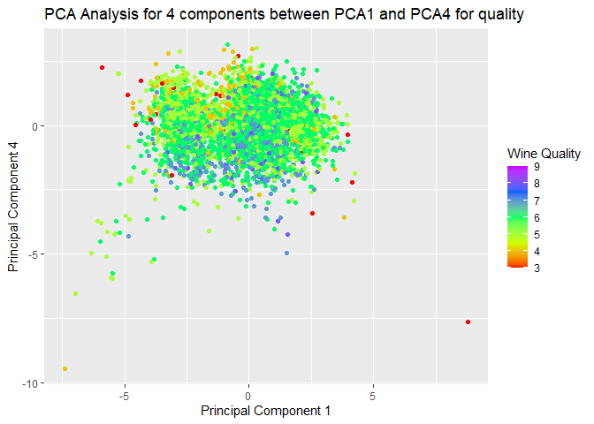
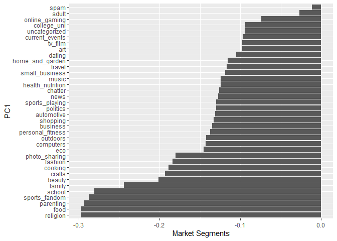
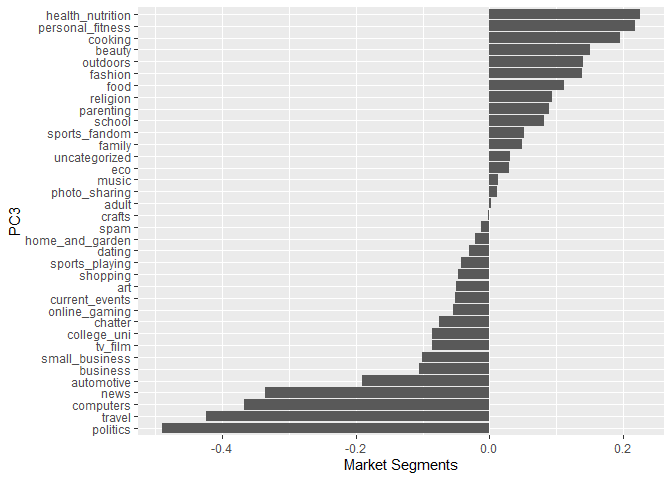
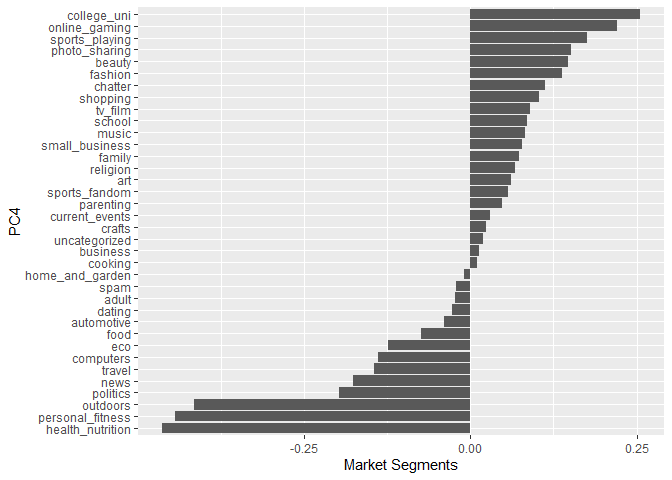
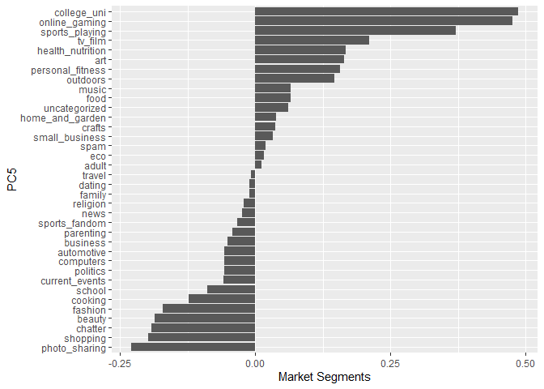

##Clustering and PCA

The idea is to see if there is any visible appearance of clustering
based on color of wine and/or quality of wine. We work with 2 and 10
clusters for wine and quality seperation respectively. We perform both
kmeans clustering and hierarchial clustering. But dues to presence of
too many outliers hierarchial clustering doesnt provide satisfying
results. Next we also explore PCA. We start with 2 summaries and that
gives us good results for clustering based on color of wine. To get
better results for clustering based on quality we try with 4 components
that cummulatively explain nearly 74% of the variation in the data but
individually dont explain much.

Lets look at Kmeans and Kmeans++ clustering.

KMEANS Analyse if any clustering occurs with 2 clusters based on wine
color

Analyse if any clustering occurs with 10 clusters based on wine quality

KMEANS++ Analyse if any clustering occurs with 2 clusters based on wine
color

Analyse if any clustering occurs with 10 clusters based on wine quality

 Both
kmeans and kmeans++ provide good results for clustering for wine color
but neither does that well for quality based clustering. If we have to
pick one of these two models we will use within and bewtween clusters to
check which is better.

<table class=" lightable-material-dark" style="font-family: &quot;Source Sans Pro&quot;, helvetica, sans-serif; margin-left: auto; margin-right: auto;">
<thead>
<tr>
<th style="text-align:left;">
</th>
<th style="text-align:right;">
Kmeans
</th>
<th style="text-align:right;">
Kmeans++
</th>
</tr>
</thead>
<tbody>
<tr>
<td style="text-align:left;">
within cluster error for wine
</td>
<td style="text-align:right;">
56135.28
</td>
<td style="text-align:right;">
56135.28
</td>
</tr>
<tr>
<td style="text-align:left;">
between cluster error for wine
</td>
<td style="text-align:right;">
15320.72
</td>
<td style="text-align:right;">
15320.72
</td>
</tr>
<tr>
<td style="text-align:left;">
within cluster error for quality
</td>
<td style="text-align:right;">
30661.38
</td>
<td style="text-align:right;">
30491.97
</td>
</tr>
<tr>
<td style="text-align:left;">
between cluster error for quality
</td>
<td style="text-align:right;">
40794.62
</td>
<td style="text-align:right;">
40964.03
</td>
</tr>
</tbody>
</table>

Clearly Kmeans++ would be our preference as it has a higher between
cluster error and lower within clsuter error indicating more homgeneity
and seperated clsuters.

Now we try using PCA analysis First we use 2 components and see if any
indicative clustering occurs for both color and quality

<table class=" lightable-material-dark" style="font-family: &quot;Source Sans Pro&quot;, helvetica, sans-serif; margin-left: auto; margin-right: auto;">
<thead>
<tr>
<th style="text-align:left;">
features
</th>
<th style="text-align:right;">
PC1
</th>
<th style="text-align:right;">
PC2
</th>
</tr>
</thead>
<tbody>
<tr>
<td style="text-align:left;">
fixed.acidity
</td>
<td style="text-align:right;">
-0.2387989
</td>
<td style="text-align:right;">
0.3363545
</td>
</tr>
<tr>
<td style="text-align:left;">
volatile.acidity
</td>
<td style="text-align:right;">
-0.3807575
</td>
<td style="text-align:right;">
0.1175497
</td>
</tr>
<tr>
<td style="text-align:left;">
citric.acid
</td>
<td style="text-align:right;">
0.1523884
</td>
<td style="text-align:right;">
0.1832994
</td>
</tr>
<tr>
<td style="text-align:left;">
residual.sugar
</td>
<td style="text-align:right;">
0.3459199
</td>
<td style="text-align:right;">
0.3299142
</td>
</tr>
<tr>
<td style="text-align:left;">
chlorides
</td>
<td style="text-align:right;">
-0.2901126
</td>
<td style="text-align:right;">
0.3152580
</td>
</tr>
<tr>
<td style="text-align:left;">
free.sulfur.dioxide
</td>
<td style="text-align:right;">
0.4309140
</td>
<td style="text-align:right;">
0.0719326
</td>
</tr>
<tr>
<td style="text-align:left;">
total.sulfur.dioxide
</td>
<td style="text-align:right;">
0.4874181
</td>
<td style="text-align:right;">
0.0872663
</td>
</tr>
<tr>
<td style="text-align:left;">
density
</td>
<td style="text-align:right;">
-0.0449366
</td>
<td style="text-align:right;">
0.5840373
</td>
</tr>
<tr>
<td style="text-align:left;">
pH
</td>
<td style="text-align:right;">
-0.2186864
</td>
<td style="text-align:right;">
-0.1558690
</td>
</tr>
<tr>
<td style="text-align:left;">
sulphates
</td>
<td style="text-align:right;">
-0.2941352
</td>
<td style="text-align:right;">
0.1917158
</td>
</tr>
<tr>
<td style="text-align:left;">
alcohol
</td>
<td style="text-align:right;">
-0.1064371
</td>
<td style="text-align:right;">
-0.4650577
</td>
</tr>
</tbody>
</table>

    ## Importance of first k=2 (out of 11) components:
    ##                           PC1    PC2
    ## Standard deviation     1.7407 1.5792
    ## Proportion of Variance 0.2754 0.2267
    ## Cumulative Proportion  0.2754 0.5021

While we can be quite satisfied with clustering based on color, we can
increase summaries to improve clustering based on quality. This is also
evident from the fact that 2 components explain only 50% of the
variation in the data.

<table class=" lightable-material-dark" style="font-family: &quot;Source Sans Pro&quot;, helvetica, sans-serif; margin-left: auto; margin-right: auto;">
<thead>
<tr>
<th style="text-align:left;">
features
</th>
<th style="text-align:right;">
PC1
</th>
<th style="text-align:right;">
PC2
</th>
<th style="text-align:right;">
PC3
</th>
<th style="text-align:right;">
PC4
</th>
</tr>
</thead>
<tbody>
<tr>
<td style="text-align:left;">
fixed.acidity
</td>
<td style="text-align:right;">
-0.2387989
</td>
<td style="text-align:right;">
0.3363545
</td>
<td style="text-align:right;">
-0.4343013
</td>
<td style="text-align:right;">
0.1643462
</td>
</tr>
<tr>
<td style="text-align:left;">
volatile.acidity
</td>
<td style="text-align:right;">
-0.3807575
</td>
<td style="text-align:right;">
0.1175497
</td>
<td style="text-align:right;">
0.3072594
</td>
<td style="text-align:right;">
0.2127849
</td>
</tr>
<tr>
<td style="text-align:left;">
citric.acid
</td>
<td style="text-align:right;">
0.1523884
</td>
<td style="text-align:right;">
0.1832994
</td>
<td style="text-align:right;">
-0.5905697
</td>
<td style="text-align:right;">
-0.2643003
</td>
</tr>
<tr>
<td style="text-align:left;">
residual.sugar
</td>
<td style="text-align:right;">
0.3459199
</td>
<td style="text-align:right;">
0.3299142
</td>
<td style="text-align:right;">
0.1646884
</td>
<td style="text-align:right;">
0.1674430
</td>
</tr>
<tr>
<td style="text-align:left;">
chlorides
</td>
<td style="text-align:right;">
-0.2901126
</td>
<td style="text-align:right;">
0.3152580
</td>
<td style="text-align:right;">
0.0166791
</td>
<td style="text-align:right;">
-0.2447439
</td>
</tr>
<tr>
<td style="text-align:left;">
free.sulfur.dioxide
</td>
<td style="text-align:right;">
0.4309140
</td>
<td style="text-align:right;">
0.0719326
</td>
<td style="text-align:right;">
0.1342239
</td>
<td style="text-align:right;">
-0.3572789
</td>
</tr>
<tr>
<td style="text-align:left;">
total.sulfur.dioxide
</td>
<td style="text-align:right;">
0.4874181
</td>
<td style="text-align:right;">
0.0872663
</td>
<td style="text-align:right;">
0.1074623
</td>
<td style="text-align:right;">
-0.2084201
</td>
</tr>
<tr>
<td style="text-align:left;">
density
</td>
<td style="text-align:right;">
-0.0449366
</td>
<td style="text-align:right;">
0.5840373
</td>
<td style="text-align:right;">
0.1756056
</td>
<td style="text-align:right;">
0.0727250
</td>
</tr>
<tr>
<td style="text-align:left;">
pH
</td>
<td style="text-align:right;">
-0.2186864
</td>
<td style="text-align:right;">
-0.1558690
</td>
<td style="text-align:right;">
0.4553241
</td>
<td style="text-align:right;">
-0.4145511
</td>
</tr>
<tr>
<td style="text-align:left;">
sulphates
</td>
<td style="text-align:right;">
-0.2941352
</td>
<td style="text-align:right;">
0.1917158
</td>
<td style="text-align:right;">
-0.0700425
</td>
<td style="text-align:right;">
-0.6405357
</td>
</tr>
<tr>
<td style="text-align:left;">
alcohol
</td>
<td style="text-align:right;">
-0.1064371
</td>
<td style="text-align:right;">
-0.4650577
</td>
<td style="text-align:right;">
-0.2611005
</td>
<td style="text-align:right;">
-0.1068027
</td>
</tr>
</tbody>
</table>

    ## Importance of first k=4 (out of 11) components:
    ##                           PC1    PC2    PC3     PC4
    ## Standard deviation     1.7407 1.5792 1.2475 0.98517
    ## Proportion of Variance 0.2754 0.2267 0.1415 0.08823
    ## Cumulative Proportion  0.2754 0.5021 0.6436 0.73187

Not the most impressive result but still much better. 4 components are
able to explain a lot more of the variation but not completely. So if i
had to use supervised learning models on PCA i would pick the model with
4 components versus 2 components.

##Market Segmentation

This is a common use case in machine learning and analysing this data
will give interesting insights into the market segments preffered by
followers of the brand to NutritionH20. If we notice some significant
correlation between these segments (my guess is that we will) then it
may make sense to perform PCA and reduce the segments from 36 to
whatever seems suitable.

 I do
require a optimal number of clusters and I think computing from the
elbow plot might be a good starting point for the same.

From this plot I would start with 10 clusters.

 This
is just to get a pictorial view of 10 clustering of the data. I have
taken two highly correlated market segments.

Next we do PCA on this

<table class=" lightable-material-dark" style="font-family: &quot;Source Sans Pro&quot;, helvetica, sans-serif; margin-left: auto; margin-right: auto;">
<thead>
<tr>
<th style="text-align:left;">
</th>
<th style="text-align:right;">
PC1
</th>
<th style="text-align:right;">
PC2
</th>
<th style="text-align:right;">
PC3
</th>
<th style="text-align:right;">
PC4
</th>
<th style="text-align:right;">
PC5
</th>
</tr>
</thead>
<tbody>
<tr>
<td style="text-align:left;">
chatter
</td>
<td style="text-align:right;">
-0.1975899
</td>
<td style="text-align:right;">
0.2480803
</td>
<td style="text-align:right;">
-0.1472928
</td>
<td style="text-align:right;">
0.1967668
</td>
<td style="text-align:right;">
-0.3216062
</td>
</tr>
<tr>
<td style="text-align:left;">
current_events
</td>
<td style="text-align:right;">
-0.0608918
</td>
<td style="text-align:right;">
0.1406842
</td>
<td style="text-align:right;">
-0.0157873
</td>
<td style="text-align:right;">
0.0506477
</td>
<td style="text-align:right;">
-0.1244933
</td>
</tr>
<tr>
<td style="text-align:left;">
travel
</td>
<td style="text-align:right;">
-0.0132345
</td>
<td style="text-align:right;">
0.1822554
</td>
<td style="text-align:right;">
0.2668629
</td>
<td style="text-align:right;">
0.0704735
</td>
<td style="text-align:right;">
0.2011001
</td>
</tr>
<tr>
<td style="text-align:left;">
photo_sharing
</td>
<td style="text-align:right;">
-0.2352407
</td>
<td style="text-align:right;">
0.1326765
</td>
<td style="text-align:right;">
-0.2626028
</td>
<td style="text-align:right;">
0.2048957
</td>
<td style="text-align:right;">
-0.1241619
</td>
</tr>
<tr>
<td style="text-align:left;">
uncategorized
</td>
<td style="text-align:right;">
-0.0772338
</td>
<td style="text-align:right;">
0.0429770
</td>
<td style="text-align:right;">
-0.0273236
</td>
<td style="text-align:right;">
-0.0282670
</td>
<td style="text-align:right;">
-0.0194838
</td>
</tr>
<tr>
<td style="text-align:left;">
tv_film
</td>
<td style="text-align:right;">
-0.0334057
</td>
<td style="text-align:right;">
0.1226475
</td>
<td style="text-align:right;">
0.0234617
</td>
<td style="text-align:right;">
-0.1985453
</td>
<td style="text-align:right;">
0.0007153
</td>
</tr>
<tr>
<td style="text-align:left;">
sports_fandom
</td>
<td style="text-align:right;">
0.4080358
</td>
<td style="text-align:right;">
0.0410039
</td>
<td style="text-align:right;">
-0.0786319
</td>
<td style="text-align:right;">
0.0300435
</td>
<td style="text-align:right;">
-0.0138759
</td>
</tr>
<tr>
<td style="text-align:left;">
politics
</td>
<td style="text-align:right;">
0.0395618
</td>
<td style="text-align:right;">
0.2122630
</td>
<td style="text-align:right;">
0.3882656
</td>
<td style="text-align:right;">
0.1667712
</td>
<td style="text-align:right;">
0.2595698
</td>
</tr>
<tr>
<td style="text-align:left;">
food
</td>
<td style="text-align:right;">
0.3455919
</td>
<td style="text-align:right;">
-0.1151529
</td>
<td style="text-align:right;">
-0.0478261
</td>
<td style="text-align:right;">
-0.0482440
</td>
<td style="text-align:right;">
-0.0910880
</td>
</tr>
<tr>
<td style="text-align:left;">
family
</td>
<td style="text-align:right;">
0.2370016
</td>
<td style="text-align:right;">
0.0491769
</td>
<td style="text-align:right;">
-0.1009776
</td>
<td style="text-align:right;">
0.0057173
</td>
<td style="text-align:right;">
-0.0680072
</td>
</tr>
<tr>
<td style="text-align:left;">
home_and_garden
</td>
<td style="text-align:right;">
-0.0220907
</td>
<td style="text-align:right;">
0.0449082
</td>
<td style="text-align:right;">
-0.0018547
</td>
<td style="text-align:right;">
0.0117647
</td>
<td style="text-align:right;">
-0.0456691
</td>
</tr>
<tr>
<td style="text-align:left;">
music
</td>
<td style="text-align:right;">
-0.0539143
</td>
<td style="text-align:right;">
0.0386283
</td>
<td style="text-align:right;">
-0.0809505
</td>
<td style="text-align:right;">
-0.0685288
</td>
<td style="text-align:right;">
0.0250874
</td>
</tr>
<tr>
<td style="text-align:left;">
news
</td>
<td style="text-align:right;">
0.0982609
</td>
<td style="text-align:right;">
0.1268346
</td>
<td style="text-align:right;">
0.3373947
</td>
<td style="text-align:right;">
0.1327367
</td>
<td style="text-align:right;">
0.2280609
</td>
</tr>
<tr>
<td style="text-align:left;">
online_gaming
</td>
<td style="text-align:right;">
-0.0705210
</td>
<td style="text-align:right;">
0.0556572
</td>
<td style="text-align:right;">
0.0160237
</td>
<td style="text-align:right;">
-0.5194713
</td>
<td style="text-align:right;">
0.0255499
</td>
</tr>
<tr>
<td style="text-align:left;">
shopping
</td>
<td style="text-align:right;">
-0.1787867
</td>
<td style="text-align:right;">
0.1690414
</td>
<td style="text-align:right;">
-0.1576784
</td>
<td style="text-align:right;">
0.1982797
</td>
<td style="text-align:right;">
-0.2752010
</td>
</tr>
<tr>
<td style="text-align:left;">
health_nutrition
</td>
<td style="text-align:right;">
-0.0668314
</td>
<td style="text-align:right;">
-0.4734191
</td>
<td style="text-align:right;">
0.2183781
</td>
<td style="text-align:right;">
0.0221055
</td>
<td style="text-align:right;">
-0.1979115
</td>
</tr>
<tr>
<td style="text-align:left;">
college_uni
</td>
<td style="text-align:right;">
-0.0872661
</td>
<td style="text-align:right;">
0.1018343
</td>
<td style="text-align:right;">
-0.0031125
</td>
<td style="text-align:right;">
-0.5549200
</td>
<td style="text-align:right;">
0.0307502
</td>
</tr>
<tr>
<td style="text-align:left;">
sports_playing
</td>
<td style="text-align:right;">
-0.0562136
</td>
<td style="text-align:right;">
0.0488126
</td>
<td style="text-align:right;">
-0.0277698
</td>
<td style="text-align:right;">
-0.3429553
</td>
<td style="text-align:right;">
0.0260842
</td>
</tr>
<tr>
<td style="text-align:left;">
cooking
</td>
<td style="text-align:right;">
-0.1668881
</td>
<td style="text-align:right;">
-0.3008648
</td>
<td style="text-align:right;">
-0.2204246
</td>
<td style="text-align:right;">
0.0873051
</td>
<td style="text-align:right;">
0.3726213
</td>
</tr>
<tr>
<td style="text-align:left;">
eco
</td>
<td style="text-align:right;">
-0.0308353
</td>
<td style="text-align:right;">
-0.0242025
</td>
<td style="text-align:right;">
0.0010274
</td>
<td style="text-align:right;">
0.0586068
</td>
<td style="text-align:right;">
-0.1481715
</td>
</tr>
<tr>
<td style="text-align:left;">
computers
</td>
<td style="text-align:right;">
0.0160870
</td>
<td style="text-align:right;">
0.1247312
</td>
<td style="text-align:right;">
0.1910162
</td>
<td style="text-align:right;">
0.1153943
</td>
<td style="text-align:right;">
0.1705343
</td>
</tr>
<tr>
<td style="text-align:left;">
business
</td>
<td style="text-align:right;">
-0.0417828
</td>
<td style="text-align:right;">
0.0783457
</td>
<td style="text-align:right;">
-0.0249920
</td>
<td style="text-align:right;">
0.0449317
</td>
<td style="text-align:right;">
-0.0199879
</td>
</tr>
<tr>
<td style="text-align:left;">
outdoors
</td>
<td style="text-align:right;">
-0.0168307
</td>
<td style="text-align:right;">
-0.3381732
</td>
<td style="text-align:right;">
0.2260617
</td>
<td style="text-align:right;">
0.0296874
</td>
<td style="text-align:right;">
-0.0913113
</td>
</tr>
<tr>
<td style="text-align:left;">
crafts
</td>
<td style="text-align:right;">
0.0717104
</td>
<td style="text-align:right;">
0.0304891
</td>
<td style="text-align:right;">
-0.0510418
</td>
<td style="text-align:right;">
-0.0083744
</td>
<td style="text-align:right;">
-0.0647362
</td>
</tr>
<tr>
<td style="text-align:left;">
automotive
</td>
<td style="text-align:right;">
0.0808430
</td>
<td style="text-align:right;">
0.1441375
</td>
<td style="text-align:right;">
0.1675895
</td>
<td style="text-align:right;">
0.1203127
</td>
<td style="text-align:right;">
0.0955183
</td>
</tr>
<tr>
<td style="text-align:left;">
art
</td>
<td style="text-align:right;">
-0.0090801
</td>
<td style="text-align:right;">
0.0425026
</td>
<td style="text-align:right;">
0.0043658
</td>
<td style="text-align:right;">
-0.1486188
</td>
<td style="text-align:right;">
0.0273318
</td>
</tr>
<tr>
<td style="text-align:left;">
religion
</td>
<td style="text-align:right;">
0.4233344
</td>
<td style="text-align:right;">
-0.0216919
</td>
<td style="text-align:right;">
-0.1641208
</td>
<td style="text-align:right;">
-0.0164119
</td>
<td style="text-align:right;">
-0.0223728
</td>
</tr>
<tr>
<td style="text-align:left;">
beauty
</td>
<td style="text-align:right;">
-0.0569933
</td>
<td style="text-align:right;">
-0.1374712
</td>
<td style="text-align:right;">
-0.2964247
</td>
<td style="text-align:right;">
0.0788073
</td>
<td style="text-align:right;">
0.3817464
</td>
</tr>
<tr>
<td style="text-align:left;">
parenting
</td>
<td style="text-align:right;">
0.4025340
</td>
<td style="text-align:right;">
-0.0207748
</td>
<td style="text-align:right;">
-0.1384310
</td>
<td style="text-align:right;">
0.0269295
</td>
<td style="text-align:right;">
-0.0294648
</td>
</tr>
<tr>
<td style="text-align:left;">
dating
</td>
<td style="text-align:right;">
-0.0191894
</td>
<td style="text-align:right;">
-0.0283745
</td>
<td style="text-align:right;">
-0.0191197
</td>
<td style="text-align:right;">
0.0111650
</td>
<td style="text-align:right;">
0.0468116
</td>
</tr>
<tr>
<td style="text-align:left;">
school
</td>
<td style="text-align:right;">
0.2730599
</td>
<td style="text-align:right;">
-0.0004227
</td>
<td style="text-align:right;">
-0.1904019
</td>
<td style="text-align:right;">
0.0475401
</td>
<td style="text-align:right;">
0.0016010
</td>
</tr>
<tr>
<td style="text-align:left;">
personal_fitness
</td>
<td style="text-align:right;">
-0.0636587
</td>
<td style="text-align:right;">
-0.4453884
</td>
<td style="text-align:right;">
0.2068289
</td>
<td style="text-align:right;">
0.0273340
</td>
<td style="text-align:right;">
-0.2145982
</td>
</tr>
<tr>
<td style="text-align:left;">
fashion
</td>
<td style="text-align:right;">
-0.1353484
</td>
<td style="text-align:right;">
-0.1552167
</td>
<td style="text-align:right;">
-0.3006239
</td>
<td style="text-align:right;">
0.0772475
</td>
<td style="text-align:right;">
0.4048249
</td>
</tr>
<tr>
<td style="text-align:left;">
small_business
</td>
<td style="text-align:right;">
-0.0301604
</td>
<td style="text-align:right;">
0.0813814
</td>
<td style="text-align:right;">
-0.0233629
</td>
<td style="text-align:right;">
-0.0486852
</td>
<td style="text-align:right;">
0.0023644
</td>
</tr>
<tr>
<td style="text-align:left;">
spam
</td>
<td style="text-align:right;">
0.0029063
</td>
<td style="text-align:right;">
-0.0017889
</td>
<td style="text-align:right;">
0.0230007
</td>
<td style="text-align:right;">
-0.0121189
</td>
<td style="text-align:right;">
-0.0150374
</td>
</tr>
<tr>
<td style="text-align:left;">
adult
</td>
<td style="text-align:right;">
0.0141523
</td>
<td style="text-align:right;">
-0.0047953
</td>
<td style="text-align:right;">
0.0292899
</td>
<td style="text-align:right;">
-0.0092229
</td>
<td style="text-align:right;">
-0.0170209
</td>
</tr>
</tbody>
</table>

    ## Importance of first k=5 (out of 36) components:
    ##                            PC1     PC2     PC3     PC4     PC5
    ## Standard deviation     1.69908 1.61882 1.54302 1.46058 1.40975
    ## Proportion of Variance 0.08019 0.07279 0.06614 0.05926 0.05521
    ## Cumulative Proportion  0.08019 0.15299 0.21912 0.27838 0.33358

    ## Apriori
    ## 
    ## Parameter specification:
    ##  confidence minval smax arem  aval originalSupport maxtime support minlen
    ##         0.1    0.1    1 none FALSE            TRUE       5   0.001      2
    ##  maxlen target  ext
    ##       4  rules TRUE
    ## 
    ## Algorithmic control:
    ##  filter tree heap memopt load sort verbose
    ##     0.1 TRUE TRUE  FALSE TRUE    2    TRUE
    ## 
    ## Absolute minimum support count: 9 
    ## 
    ## set item appearances ...[0 item(s)] done [0.00s].
    ## set transactions ...[170 item(s), 9835 transaction(s)] done [0.00s].
    ## sorting and recoding items ... [157 item(s)] done [0.00s].
    ## creating transaction tree ... done [0.00s].
    ## checking subsets of size 1 2 3 4 done [0.02s].
    ## writing ... [30843 rule(s)] done [0.01s].
    ## creating S4 object  ... done [0.02s].

    ##      lhs                    rhs                support     confidence
    ## [1]  {honey}             => {whole milk}       0.001118454 0.7333333 
    ## [2]  {soap}              => {whole milk}       0.001118454 0.4230769 
    ## [3]  {tidbits}           => {soda}             0.001016777 0.4347826 
    ## [4]  {tidbits}           => {rolls/buns}       0.001220132 0.5217391 
    ## [5]  {cocoa drinks}      => {whole milk}       0.001321810 0.5909091 
    ## [6]  {snack products}    => {soda}             0.001118454 0.3666667 
    ## [7]  {snack products}    => {rolls/buns}       0.001118454 0.3666667 
    ## [8]  {pudding powder}    => {whole milk}       0.001321810 0.5652174 
    ## [9]  {cooking chocolate} => {whole milk}       0.001321810 0.5200000 
    ## [10] {bathroom cleaner}  => {soda}             0.001016777 0.3703704 
    ## [11] {bathroom cleaner}  => {other vegetables} 0.001016777 0.3703704 
    ## [12] {nuts/prunes}       => {rolls/buns}       0.001016777 0.3030303 
    ## [13] {nuts/prunes}       => {whole milk}       0.001220132 0.3636364 
    ## [14] {brandy}            => {shopping bags}    0.001321810 0.3170732 
    ## [15] {brandy}            => {rolls/buns}       0.001118454 0.2682927 
    ## [16] {nut snack}         => {soda}             0.001016777 0.3225806 
    ## [17] {potato products}   => {pastry}           0.001016777 0.3571429 
    ## [18] {potato products}   => {whole milk}       0.001220132 0.4285714 
    ## [19] {artif. sweetener}  => {yogurt}           0.001118454 0.3437500 
    ## [20] {artif. sweetener}  => {other vegetables} 0.001016777 0.3125000 
    ## [21] {artif. sweetener}  => {whole milk}       0.001118454 0.3437500 
    ## [22] {male cosmetics}    => {bottled water}    0.001321810 0.2888889 
    ## [23] {male cosmetics}    => {yogurt}           0.001016777 0.2222222 
    ## [24] {light bulbs}       => {yogurt}           0.001220132 0.2926829 
    ## [25] {light bulbs}       => {other vegetables} 0.001321810 0.3170732 
    ## [26] {syrup}             => {other vegetables} 0.001118454 0.3437500 
    ## [27] {canned fruit}      => {citrus fruit}     0.001118454 0.3437500 
    ## [28] {canned fruit}      => {other vegetables} 0.001118454 0.3437500 
    ## [29] {canned fruit}      => {whole milk}       0.001321810 0.4062500 
    ## [30] {rum}               => {other vegetables} 0.001525165 0.3409091 
    ## [31] {rum}               => {whole milk}       0.001728521 0.3863636 
    ## [32] {meat spreads}      => {cream cheese}     0.001118454 0.2619048 
    ## [33] {meat spreads}      => {soda}             0.001423488 0.3333333 
    ## [34] {meat spreads}      => {yogurt}           0.001830198 0.4285714 
    ## [35] {meat spreads}      => {rolls/buns}       0.001321810 0.3095238 
    ## [36] {meat spreads}      => {whole milk}       0.001321810 0.3095238 
    ## [37] {skin care}         => {yogurt}           0.001016777 0.2857143 
    ## [38] {skin care}         => {rolls/buns}       0.001423488 0.4000000 
    ## [39] {skin care}         => {other vegetables} 0.001220132 0.3428571 
    ## [40] {skin care}         => {whole milk}       0.001626843 0.4571429 
    ## [41] {specialty fat}     => {margarine}        0.001220132 0.3333333 
    ## [42] {specialty fat}     => {other vegetables} 0.001118454 0.3055556 
    ## [43] {specialty fat}     => {whole milk}       0.001220132 0.3333333 
    ## [44] {sparkling wine}    => {root vegetables}  0.001016777 0.1818182 
    ## [45] {sparkling wine}    => {other vegetables} 0.001525165 0.2727273 
    ## [46] {sparkling wine}    => {whole milk}       0.001016777 0.1818182 
    ## [47] {tea}               => {bottled beer}     0.001118454 0.2894737 
    ## [48] {tea}               => {tropical fruit}   0.001321810 0.3421053 
    ## [49] {tea}               => {rolls/buns}       0.001118454 0.2894737 
    ## [50] {tea}               => {other vegetables} 0.001525165 0.3947368 
    ##      coverage    lift      count
    ## [1]  0.001525165 2.8700093 11   
    ## [2]  0.002643620 1.6557746 11   
    ## [3]  0.002338587 2.4933452 10   
    ## [4]  0.002338587 2.8365419 12   
    ## [5]  0.002236909 2.3126108 13   
    ## [6]  0.003050330 2.1027211 11   
    ## [7]  0.003050330 1.9934586 11   
    ## [8]  0.002338587 2.2120625 13   
    ## [9]  0.002541942 2.0350975 13   
    ## [10] 0.002745297 2.1239607 10   
    ## [11] 0.002745297 1.9141317 10   
    ## [12] 0.003355363 1.6474865 10   
    ## [13] 0.003355363 1.4231451 12   
    ## [14] 0.004168785 3.2181782 13   
    ## [15] 0.004168785 1.4586283 11   
    ## [16] 0.003152008 1.8499013 10   
    ## [17] 0.002846975 4.0142857 10   
    ## [18] 0.002846975 1.6772782 12   
    ## [19] 0.003253686 2.4641263 11   
    ## [20] 0.003253686 1.6150486 10   
    ## [21] 0.003253686 1.3453169 11   
    ## [22] 0.004575496 2.6138199 13   
    ## [23] 0.004575496 1.5929705 10   
    ## [24] 0.004168785 2.0980587 12   
    ## [25] 0.004168785 1.6386835 13   
    ## [26] 0.003253686 1.7765535 11   
    ## [27] 0.003253686 4.1584025 11   
    ## [28] 0.003253686 1.7765535 11   
    ## [29] 0.003253686 1.5899199 13   
    ## [30] 0.004473818 1.7618712 15   
    ## [31] 0.004473818 1.5120917 17   
    ## [32] 0.004270463 6.6047009 11   
    ## [33] 0.004270463 1.9115646 14   
    ## [34] 0.004270463 3.0721574 18   
    ## [35] 0.004270463 1.6827898 13   
    ## [36] 0.004270463 1.2113676 13   
    ## [37] 0.003558719 2.0481050 10   
    ## [38] 0.003558719 2.1746821 14   
    ## [39] 0.003558719 1.7719390 12   
    ## [40] 0.003558719 1.7890967 16   
    ## [41] 0.003660397 5.7014493 12   
    ## [42] 0.003660397 1.5791586 11   
    ## [43] 0.003660397 1.3045497 12   
    ## [44] 0.005592272 1.6680801 10   
    ## [45] 0.005592272 1.4094970 15   
    ## [46] 0.005592272 0.7115726 10   
    ## [47] 0.003863752 3.5946637 11   
    ## [48] 0.003863752 3.2602764 13   
    ## [49] 0.003863752 1.5737831 11   
    ## [50] 0.003863752 2.0400614 15

