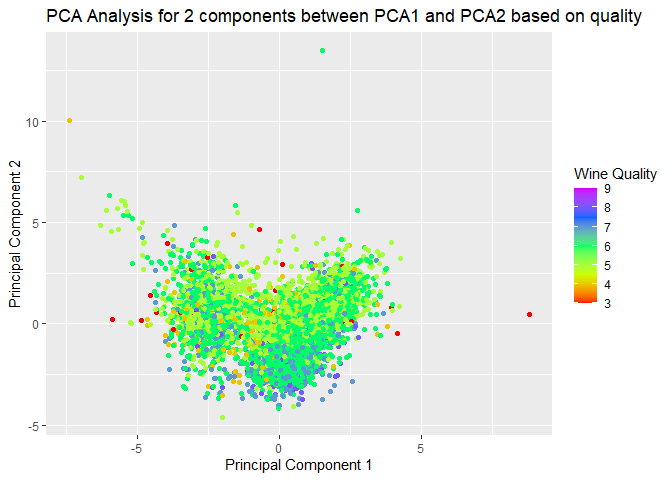
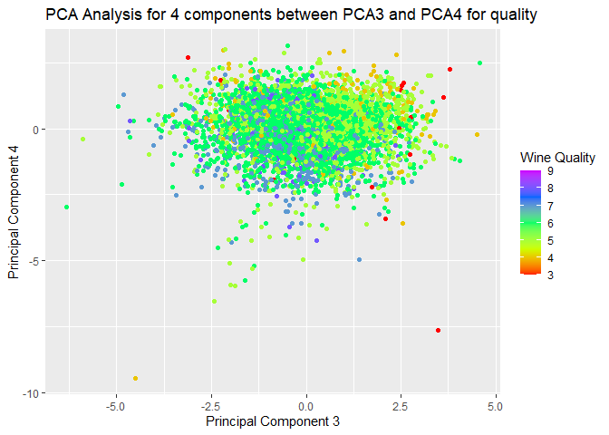
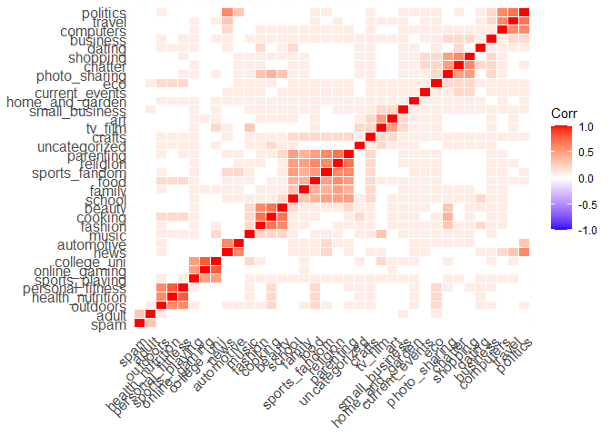
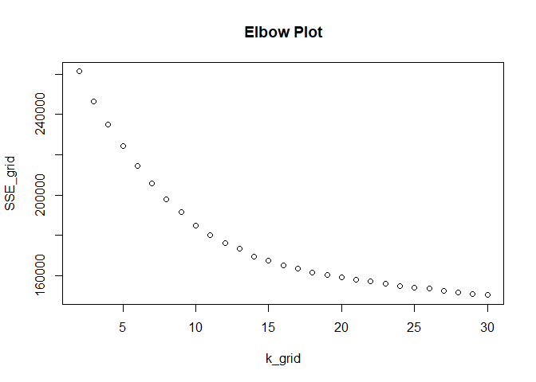
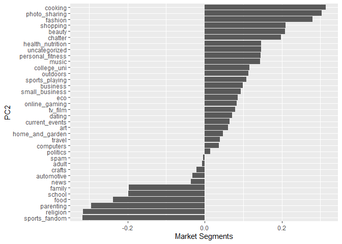

##Clustering and PCA

The idea is to see if there is any visible appearance of clustering
based on color of wine and/or quality of wine. We work with 2 and 10
clusters for wine and quality seperation respectively. We perform both
kmeans clustering and hierarchial clustering. But dues to presence of
too many outliers hierarchial clustering doesnt provide satisfying
results. Next we also explore PCA. We start with 2 summaries and that
gives us good results for clustering based on color of wine. To get
better results for clustering based on quality we try with 4 components
that cummulatively explain nearly 74% of the variation in the data but
individually dont explain much.

Lets look at Kmeans and Kmeans++ clustering.

KMEANS Analyse if any clustering occurs with 2 clusters based on wine
color

Analyse if any clustering occurs with 10 clusters based on wine quality

KMEANS++ Analyse if any clustering occurs with 2 clusters based on wine
color

Analyse if any clustering occurs with 10 clusters based on wine quality

 Both
kmeans and kmeans++ provide good results for clustering for wine color
but neither does that well for quality based clustering. If we have to
pick one of these two models we will use within and bewtween clusters to
check which is better.

<table class=" lightable-material-dark" style="font-family: &quot;Source Sans Pro&quot;, helvetica, sans-serif; margin-left: auto; margin-right: auto;">
<thead>
<tr>
<th style="text-align:left;">
</th>
<th style="text-align:right;">
Kmeans
</th>
<th style="text-align:right;">
Kmeans++
</th>
</tr>
</thead>
<tbody>
<tr>
<td style="text-align:left;">
within cluster error for wine
</td>
<td style="text-align:right;">
56135.28
</td>
<td style="text-align:right;">
56135.28
</td>
</tr>
<tr>
<td style="text-align:left;">
between cluster error for wine
</td>
<td style="text-align:right;">
15320.72
</td>
<td style="text-align:right;">
15320.72
</td>
</tr>
<tr>
<td style="text-align:left;">
within cluster error for quality
</td>
<td style="text-align:right;">
30661.38
</td>
<td style="text-align:right;">
30491.97
</td>
</tr>
<tr>
<td style="text-align:left;">
between cluster error for quality
</td>
<td style="text-align:right;">
40794.62
</td>
<td style="text-align:right;">
40964.03
</td>
</tr>
</tbody>
</table>

Clearly Kmeans++ would be our preference as it has a higher between
cluster error and lower within clsuter error indicating more homgeneity
and seperated clsuters.

Now we try using PCA analysis First we use 2 components and see if any
indicative clustering occurs for both color and quality

<table class=" lightable-material-dark" style="font-family: &quot;Source Sans Pro&quot;, helvetica, sans-serif; margin-left: auto; margin-right: auto;">
<thead>
<tr>
<th style="text-align:left;">
features
</th>
<th style="text-align:right;">
PC1
</th>
<th style="text-align:right;">
PC2
</th>
</tr>
</thead>
<tbody>
<tr>
<td style="text-align:left;">
fixed.acidity
</td>
<td style="text-align:right;">
-0.2387989
</td>
<td style="text-align:right;">
0.3363545
</td>
</tr>
<tr>
<td style="text-align:left;">
volatile.acidity
</td>
<td style="text-align:right;">
-0.3807575
</td>
<td style="text-align:right;">
0.1175497
</td>
</tr>
<tr>
<td style="text-align:left;">
citric.acid
</td>
<td style="text-align:right;">
0.1523884
</td>
<td style="text-align:right;">
0.1832994
</td>
</tr>
<tr>
<td style="text-align:left;">
residual.sugar
</td>
<td style="text-align:right;">
0.3459199
</td>
<td style="text-align:right;">
0.3299142
</td>
</tr>
<tr>
<td style="text-align:left;">
chlorides
</td>
<td style="text-align:right;">
-0.2901126
</td>
<td style="text-align:right;">
0.3152580
</td>
</tr>
<tr>
<td style="text-align:left;">
free.sulfur.dioxide
</td>
<td style="text-align:right;">
0.4309140
</td>
<td style="text-align:right;">
0.0719326
</td>
</tr>
<tr>
<td style="text-align:left;">
total.sulfur.dioxide
</td>
<td style="text-align:right;">
0.4874181
</td>
<td style="text-align:right;">
0.0872663
</td>
</tr>
<tr>
<td style="text-align:left;">
density
</td>
<td style="text-align:right;">
-0.0449366
</td>
<td style="text-align:right;">
0.5840373
</td>
</tr>
<tr>
<td style="text-align:left;">
pH
</td>
<td style="text-align:right;">
-0.2186864
</td>
<td style="text-align:right;">
-0.1558690
</td>
</tr>
<tr>
<td style="text-align:left;">
sulphates
</td>
<td style="text-align:right;">
-0.2941352
</td>
<td style="text-align:right;">
0.1917158
</td>
</tr>
<tr>
<td style="text-align:left;">
alcohol
</td>
<td style="text-align:right;">
-0.1064371
</td>
<td style="text-align:right;">
-0.4650577
</td>
</tr>
</tbody>
</table>

    ## Importance of first k=2 (out of 11) components:
    ##                           PC1    PC2
    ## Standard deviation     1.7407 1.5792
    ## Proportion of Variance 0.2754 0.2267
    ## Cumulative Proportion  0.2754 0.5021

While we can be quite satisfied with clustering based on color, we can
increase summaries to improve clustering based on quality. This is also
evident from the fact that 2 components explain only 50% of the
variation in the data.

<table class=" lightable-material-dark" style="font-family: &quot;Source Sans Pro&quot;, helvetica, sans-serif; margin-left: auto; margin-right: auto;">
<thead>
<tr>
<th style="text-align:left;">
features
</th>
<th style="text-align:right;">
PC1
</th>
<th style="text-align:right;">
PC2
</th>
<th style="text-align:right;">
PC3
</th>
<th style="text-align:right;">
PC4
</th>
</tr>
</thead>
<tbody>
<tr>
<td style="text-align:left;">
fixed.acidity
</td>
<td style="text-align:right;">
-0.2387989
</td>
<td style="text-align:right;">
0.3363545
</td>
<td style="text-align:right;">
-0.4343013
</td>
<td style="text-align:right;">
0.1643462
</td>
</tr>
<tr>
<td style="text-align:left;">
volatile.acidity
</td>
<td style="text-align:right;">
-0.3807575
</td>
<td style="text-align:right;">
0.1175497
</td>
<td style="text-align:right;">
0.3072594
</td>
<td style="text-align:right;">
0.2127849
</td>
</tr>
<tr>
<td style="text-align:left;">
citric.acid
</td>
<td style="text-align:right;">
0.1523884
</td>
<td style="text-align:right;">
0.1832994
</td>
<td style="text-align:right;">
-0.5905697
</td>
<td style="text-align:right;">
-0.2643003
</td>
</tr>
<tr>
<td style="text-align:left;">
residual.sugar
</td>
<td style="text-align:right;">
0.3459199
</td>
<td style="text-align:right;">
0.3299142
</td>
<td style="text-align:right;">
0.1646884
</td>
<td style="text-align:right;">
0.1674430
</td>
</tr>
<tr>
<td style="text-align:left;">
chlorides
</td>
<td style="text-align:right;">
-0.2901126
</td>
<td style="text-align:right;">
0.3152580
</td>
<td style="text-align:right;">
0.0166791
</td>
<td style="text-align:right;">
-0.2447439
</td>
</tr>
<tr>
<td style="text-align:left;">
free.sulfur.dioxide
</td>
<td style="text-align:right;">
0.4309140
</td>
<td style="text-align:right;">
0.0719326
</td>
<td style="text-align:right;">
0.1342239
</td>
<td style="text-align:right;">
-0.3572789
</td>
</tr>
<tr>
<td style="text-align:left;">
total.sulfur.dioxide
</td>
<td style="text-align:right;">
0.4874181
</td>
<td style="text-align:right;">
0.0872663
</td>
<td style="text-align:right;">
0.1074623
</td>
<td style="text-align:right;">
-0.2084201
</td>
</tr>
<tr>
<td style="text-align:left;">
density
</td>
<td style="text-align:right;">
-0.0449366
</td>
<td style="text-align:right;">
0.5840373
</td>
<td style="text-align:right;">
0.1756056
</td>
<td style="text-align:right;">
0.0727250
</td>
</tr>
<tr>
<td style="text-align:left;">
pH
</td>
<td style="text-align:right;">
-0.2186864
</td>
<td style="text-align:right;">
-0.1558690
</td>
<td style="text-align:right;">
0.4553241
</td>
<td style="text-align:right;">
-0.4145511
</td>
</tr>
<tr>
<td style="text-align:left;">
sulphates
</td>
<td style="text-align:right;">
-0.2941352
</td>
<td style="text-align:right;">
0.1917158
</td>
<td style="text-align:right;">
-0.0700425
</td>
<td style="text-align:right;">
-0.6405357
</td>
</tr>
<tr>
<td style="text-align:left;">
alcohol
</td>
<td style="text-align:right;">
-0.1064371
</td>
<td style="text-align:right;">
-0.4650577
</td>
<td style="text-align:right;">
-0.2611005
</td>
<td style="text-align:right;">
-0.1068027
</td>
</tr>
</tbody>
</table>

    ## Importance of first k=4 (out of 11) components:
    ##                           PC1    PC2    PC3     PC4
    ## Standard deviation     1.7407 1.5792 1.2475 0.98517
    ## Proportion of Variance 0.2754 0.2267 0.1415 0.08823
    ## Cumulative Proportion  0.2754 0.5021 0.6436 0.73187

Not the most impressive result but still much better. 4 components are
able to explain a lot more of the variation but not completely. So if i
had to use supervised learning models on PCA i would pick the model with
4 components versus 2 components.

##Market Segmentation

This is a common use case in machine learning and analysing this data
will give interesting insights into the market segments preffered by
followers of the brand to NutritionH20. If we notice some significant
correlation between these segments (my guess is that we will) then it
may make sense to perform PCA and reduce the segments from 36 to
whatever seems suitable.

 I do
require a optimal number of clusters and I think computing from the
elbow plot might be a good starting point for the same.

From this plot I would start with 15 clusters.

 This
is just to get a pictorial view of 15 clustering of the data. I have
taken two highly correlated market segments.

Next we do PCA on this

<table class=" lightable-material-dark" style="font-family: &quot;Source Sans Pro&quot;, helvetica, sans-serif; margin-left: auto; margin-right: auto;">
<thead>
<tr>
<th style="text-align:left;">
</th>
<th style="text-align:right;">
PC1
</th>
<th style="text-align:right;">
PC2
</th>
<th style="text-align:right;">
PC3
</th>
<th style="text-align:right;">
PC4
</th>
<th style="text-align:right;">
PC5
</th>
<th style="text-align:right;">
PC6
</th>
<th style="text-align:right;">
PC7
</th>
<th style="text-align:right;">
PC8
</th>
<th style="text-align:right;">
PC9
</th>
<th style="text-align:right;">
PC10
</th>
<th style="text-align:right;">
PC11
</th>
<th style="text-align:right;">
PC12
</th>
<th style="text-align:right;">
PC13
</th>
<th style="text-align:right;">
PC14
</th>
<th style="text-align:right;">
PC15
</th>
</tr>
</thead>
<tbody>
<tr>
<td style="text-align:left;">
chatter
</td>
<td style="text-align:right;">
-0.1259924
</td>
<td style="text-align:right;">
0.1972255
</td>
<td style="text-align:right;">
-0.0748069
</td>
<td style="text-align:right;">
0.1128314
</td>
<td style="text-align:right;">
-0.1927820
</td>
<td style="text-align:right;">
0.4610495
</td>
<td style="text-align:right;">
-0.1077307
</td>
<td style="text-align:right;">
0.0708599
</td>
<td style="text-align:right;">
-0.0163368
</td>
<td style="text-align:right;">
0.1070721
</td>
<td style="text-align:right;">
-0.0047018
</td>
<td style="text-align:right;">
-0.0767817
</td>
<td style="text-align:right;">
-0.0059865
</td>
<td style="text-align:right;">
0.0761074
</td>
<td style="text-align:right;">
0.0126302
</td>
</tr>
<tr>
<td style="text-align:left;">
current_events
</td>
<td style="text-align:right;">
-0.0972367
</td>
<td style="text-align:right;">
0.0640365
</td>
<td style="text-align:right;">
-0.0522397
</td>
<td style="text-align:right;">
0.0298486
</td>
<td style="text-align:right;">
-0.0581898
</td>
<td style="text-align:right;">
0.1394341
</td>
<td style="text-align:right;">
0.0373045
</td>
<td style="text-align:right;">
-0.0546423
</td>
<td style="text-align:right;">
-0.0197992
</td>
<td style="text-align:right;">
-0.1121153
</td>
<td style="text-align:right;">
0.0263884
</td>
<td style="text-align:right;">
0.6576252
</td>
<td style="text-align:right;">
0.6803548
</td>
<td style="text-align:right;">
-0.1043512
</td>
<td style="text-align:right;">
0.0871621
</td>
</tr>
<tr>
<td style="text-align:left;">
travel
</td>
<td style="text-align:right;">
-0.1166490
</td>
<td style="text-align:right;">
0.0399473
</td>
<td style="text-align:right;">
-0.4242597
</td>
<td style="text-align:right;">
-0.1454284
</td>
<td style="text-align:right;">
-0.0078372
</td>
<td style="text-align:right;">
-0.1635710
</td>
<td style="text-align:right;">
0.0850390
</td>
<td style="text-align:right;">
0.3069055
</td>
<td style="text-align:right;">
0.0192550
</td>
<td style="text-align:right;">
-0.1059522
</td>
<td style="text-align:right;">
-0.0132540
</td>
<td style="text-align:right;">
0.0237868
</td>
<td style="text-align:right;">
-0.0200000
</td>
<td style="text-align:right;">
0.0846484
</td>
<td style="text-align:right;">
0.0273192
</td>
</tr>
<tr>
<td style="text-align:left;">
photo_sharing
</td>
<td style="text-align:right;">
-0.1802795
</td>
<td style="text-align:right;">
0.3030776
</td>
<td style="text-align:right;">
0.0107095
</td>
<td style="text-align:right;">
0.1514910
</td>
<td style="text-align:right;">
-0.2296606
</td>
<td style="text-align:right;">
0.2113671
</td>
<td style="text-align:right;">
-0.1265067
</td>
<td style="text-align:right;">
0.0222006
</td>
<td style="text-align:right;">
0.0163140
</td>
<td style="text-align:right;">
-0.1313037
</td>
<td style="text-align:right;">
-0.0800578
</td>
<td style="text-align:right;">
-0.0560727
</td>
<td style="text-align:right;">
-0.0797077
</td>
<td style="text-align:right;">
0.0739437
</td>
<td style="text-align:right;">
-0.0195978
</td>
</tr>
<tr>
<td style="text-align:left;">
uncategorized
</td>
<td style="text-align:right;">
-0.0944351
</td>
<td style="text-align:right;">
0.1464989
</td>
<td style="text-align:right;">
0.0305419
</td>
<td style="text-align:right;">
0.0192457
</td>
<td style="text-align:right;">
0.0610212
</td>
<td style="text-align:right;">
-0.0356092
</td>
<td style="text-align:right;">
0.1873783
</td>
<td style="text-align:right;">
-0.0490875
</td>
<td style="text-align:right;">
-0.0536131
</td>
<td style="text-align:right;">
0.2669750
</td>
<td style="text-align:right;">
0.3587685
</td>
<td style="text-align:right;">
-0.1854511
</td>
<td style="text-align:right;">
0.0908244
</td>
<td style="text-align:right;">
0.4665953
</td>
<td style="text-align:right;">
0.2114008
</td>
</tr>
<tr>
<td style="text-align:left;">
tv_film
</td>
<td style="text-align:right;">
-0.0974567
</td>
<td style="text-align:right;">
0.0793525
</td>
<td style="text-align:right;">
-0.0862096
</td>
<td style="text-align:right;">
0.0899307
</td>
<td style="text-align:right;">
0.2102380
</td>
<td style="text-align:right;">
0.0617921
</td>
<td style="text-align:right;">
0.5047637
</td>
<td style="text-align:right;">
-0.2200425
</td>
<td style="text-align:right;">
0.1283925
</td>
<td style="text-align:right;">
-0.0957397
</td>
<td style="text-align:right;">
0.0427202
</td>
<td style="text-align:right;">
-0.0180031
</td>
<td style="text-align:right;">
-0.0074496
</td>
<td style="text-align:right;">
0.0089815
</td>
<td style="text-align:right;">
0.0046269
</td>
</tr>
<tr>
<td style="text-align:left;">
sports_fandom
</td>
<td style="text-align:right;">
-0.2877318
</td>
<td style="text-align:right;">
-0.3169236
</td>
<td style="text-align:right;">
0.0519967
</td>
<td style="text-align:right;">
0.0572327
</td>
<td style="text-align:right;">
-0.0327901
</td>
<td style="text-align:right;">
0.0084356
</td>
<td style="text-align:right;">
-0.0686250
</td>
<td style="text-align:right;">
-0.1095287
</td>
<td style="text-align:right;">
0.0181730
</td>
<td style="text-align:right;">
-0.0281742
</td>
<td style="text-align:right;">
0.0611708
</td>
<td style="text-align:right;">
-0.0198055
</td>
<td style="text-align:right;">
-0.0091532
</td>
<td style="text-align:right;">
-0.0045378
</td>
<td style="text-align:right;">
-0.0147725
</td>
</tr>
<tr>
<td style="text-align:left;">
politics
</td>
<td style="text-align:right;">
-0.1302662
</td>
<td style="text-align:right;">
0.0139400
</td>
<td style="text-align:right;">
-0.4899027
</td>
<td style="text-align:right;">
-0.1967260
</td>
<td style="text-align:right;">
-0.0579449
</td>
<td style="text-align:right;">
-0.1299734
</td>
<td style="text-align:right;">
-0.0652120
</td>
<td style="text-align:right;">
0.0148842
</td>
<td style="text-align:right;">
0.0345775
</td>
<td style="text-align:right;">
-0.0354560
</td>
<td style="text-align:right;">
-0.0161447
</td>
<td style="text-align:right;">
-0.0062217
</td>
<td style="text-align:right;">
-0.0096360
</td>
<td style="text-align:right;">
0.0373917
</td>
<td style="text-align:right;">
0.0272519
</td>
</tr>
<tr>
<td style="text-align:left;">
food
</td>
<td style="text-align:right;">
-0.2969095
</td>
<td style="text-align:right;">
-0.2378087
</td>
<td style="text-align:right;">
0.1114773
</td>
<td style="text-align:right;">
-0.0733288
</td>
<td style="text-align:right;">
0.0661288
</td>
<td style="text-align:right;">
0.0161941
</td>
<td style="text-align:right;">
0.0360897
</td>
<td style="text-align:right;">
0.0898326
</td>
<td style="text-align:right;">
0.0536701
</td>
<td style="text-align:right;">
-0.1034685
</td>
<td style="text-align:right;">
0.0069475
</td>
<td style="text-align:right;">
0.0055286
</td>
<td style="text-align:right;">
-0.0154795
</td>
<td style="text-align:right;">
0.0304101
</td>
<td style="text-align:right;">
0.0059862
</td>
</tr>
<tr>
<td style="text-align:left;">
family
</td>
<td style="text-align:right;">
-0.2442687
</td>
<td style="text-align:right;">
-0.1962532
</td>
<td style="text-align:right;">
0.0493184
</td>
<td style="text-align:right;">
0.0727193
</td>
<td style="text-align:right;">
-0.0107816
</td>
<td style="text-align:right;">
0.0471880
</td>
<td style="text-align:right;">
-0.1001581
</td>
<td style="text-align:right;">
-0.0221481
</td>
<td style="text-align:right;">
0.0017765
</td>
<td style="text-align:right;">
-0.1002656
</td>
<td style="text-align:right;">
-0.0476679
</td>
<td style="text-align:right;">
-0.0346990
</td>
<td style="text-align:right;">
-0.0347994
</td>
<td style="text-align:right;">
-0.0185677
</td>
<td style="text-align:right;">
-0.0139360
</td>
</tr>
<tr>
<td style="text-align:left;">
home_and_garden
</td>
<td style="text-align:right;">
-0.1157650
</td>
<td style="text-align:right;">
0.0468035
</td>
<td style="text-align:right;">
-0.0211790
</td>
<td style="text-align:right;">
-0.0099351
</td>
<td style="text-align:right;">
0.0379741
</td>
<td style="text-align:right;">
0.0387891
</td>
<td style="text-align:right;">
0.0939256
</td>
<td style="text-align:right;">
-0.0987512
</td>
<td style="text-align:right;">
-0.0805429
</td>
<td style="text-align:right;">
0.2661858
</td>
<td style="text-align:right;">
-0.0528708
</td>
<td style="text-align:right;">
0.6221241
</td>
<td style="text-align:right;">
-0.5488918
</td>
<td style="text-align:right;">
0.1816033
</td>
<td style="text-align:right;">
-0.3602613
</td>
</tr>
<tr>
<td style="text-align:left;">
music
</td>
<td style="text-align:right;">
-0.1240892
</td>
<td style="text-align:right;">
0.1442595
</td>
<td style="text-align:right;">
0.0122877
</td>
<td style="text-align:right;">
0.0825827
</td>
<td style="text-align:right;">
0.0661952
</td>
<td style="text-align:right;">
-0.0108636
</td>
<td style="text-align:right;">
0.1477405
</td>
<td style="text-align:right;">
-0.0889245
</td>
<td style="text-align:right;">
0.0729134
</td>
<td style="text-align:right;">
-0.1841356
</td>
<td style="text-align:right;">
0.6916360
</td>
<td style="text-align:right;">
0.0341660
</td>
<td style="text-align:right;">
-0.0322028
</td>
<td style="text-align:right;">
0.0593190
</td>
<td style="text-align:right;">
-0.0488862
</td>
</tr>
<tr>
<td style="text-align:left;">
news
</td>
<td style="text-align:right;">
-0.1276433
</td>
<td style="text-align:right;">
-0.0361989
</td>
<td style="text-align:right;">
-0.3360356
</td>
<td style="text-align:right;">
-0.1768761
</td>
<td style="text-align:right;">
-0.0250647
</td>
<td style="text-align:right;">
-0.0943915
</td>
<td style="text-align:right;">
-0.1437097
</td>
<td style="text-align:right;">
-0.4628432
</td>
<td style="text-align:right;">
0.0105521
</td>
<td style="text-align:right;">
0.0811766
</td>
<td style="text-align:right;">
-0.0225728
</td>
<td style="text-align:right;">
-0.0542257
</td>
<td style="text-align:right;">
0.0354216
</td>
<td style="text-align:right;">
-0.0215986
</td>
<td style="text-align:right;">
0.0170226
</td>
</tr>
<tr>
<td style="text-align:left;">
online_gaming
</td>
<td style="text-align:right;">
-0.0738898
</td>
<td style="text-align:right;">
0.0835916
</td>
<td style="text-align:right;">
-0.0551081
</td>
<td style="text-align:right;">
0.2207630
</td>
<td style="text-align:right;">
0.4764231
</td>
<td style="text-align:right;">
-0.0108467
</td>
<td style="text-align:right;">
-0.2880784
</td>
<td style="text-align:right;">
0.0606577
</td>
<td style="text-align:right;">
-0.0416637
</td>
<td style="text-align:right;">
-0.0103746
</td>
<td style="text-align:right;">
-0.1435305
</td>
<td style="text-align:right;">
-0.0132670
</td>
<td style="text-align:right;">
0.0249890
</td>
<td style="text-align:right;">
-0.0003836
</td>
<td style="text-align:right;">
-0.0027136
</td>
</tr>
<tr>
<td style="text-align:left;">
shopping
</td>
<td style="text-align:right;">
-0.1329950
</td>
<td style="text-align:right;">
0.2098528
</td>
<td style="text-align:right;">
-0.0472226
</td>
<td style="text-align:right;">
0.1036115
</td>
<td style="text-align:right;">
-0.1974542
</td>
<td style="text-align:right;">
0.4261786
</td>
<td style="text-align:right;">
-0.0860955
</td>
<td style="text-align:right;">
0.0337983
</td>
<td style="text-align:right;">
0.0491672
</td>
<td style="text-align:right;">
-0.1283639
</td>
<td style="text-align:right;">
-0.0421860
</td>
<td style="text-align:right;">
-0.0610029
</td>
<td style="text-align:right;">
-0.0874042
</td>
<td style="text-align:right;">
0.1231248
</td>
<td style="text-align:right;">
-0.0352813
</td>
</tr>
<tr>
<td style="text-align:left;">
health_nutrition
</td>
<td style="text-align:right;">
-0.1242011
</td>
<td style="text-align:right;">
0.1465778
</td>
<td style="text-align:right;">
0.2255148
</td>
<td style="text-align:right;">
-0.4634666
</td>
<td style="text-align:right;">
0.1671597
</td>
<td style="text-align:right;">
0.0788771
</td>
<td style="text-align:right;">
-0.0386183
</td>
<td style="text-align:right;">
0.0368803
</td>
<td style="text-align:right;">
0.0552426
</td>
<td style="text-align:right;">
-0.0317932
</td>
<td style="text-align:right;">
-0.0290881
</td>
<td style="text-align:right;">
-0.0061949
</td>
<td style="text-align:right;">
0.0157196
</td>
<td style="text-align:right;">
-0.0201629
</td>
<td style="text-align:right;">
-0.0288729
</td>
</tr>
<tr>
<td style="text-align:left;">
college_uni
</td>
<td style="text-align:right;">
-0.0941567
</td>
<td style="text-align:right;">
0.1159597
</td>
<td style="text-align:right;">
-0.0854124
</td>
<td style="text-align:right;">
0.2555873
</td>
<td style="text-align:right;">
0.4870183
</td>
<td style="text-align:right;">
0.0044168
</td>
<td style="text-align:right;">
-0.1854095
</td>
<td style="text-align:right;">
0.0425867
</td>
<td style="text-align:right;">
-0.0050862
</td>
<td style="text-align:right;">
-0.0421472
</td>
<td style="text-align:right;">
0.0504708
</td>
<td style="text-align:right;">
0.0100942
</td>
<td style="text-align:right;">
0.0085032
</td>
<td style="text-align:right;">
-0.0011934
</td>
<td style="text-align:right;">
-0.0152637
</td>
</tr>
<tr>
<td style="text-align:left;">
sports_playing
</td>
<td style="text-align:right;">
-0.1302165
</td>
<td style="text-align:right;">
0.1085954
</td>
<td style="text-align:right;">
-0.0425946
</td>
<td style="text-align:right;">
0.1756699
</td>
<td style="text-align:right;">
0.3706463
</td>
<td style="text-align:right;">
-0.0270353
</td>
<td style="text-align:right;">
-0.2186161
</td>
<td style="text-align:right;">
0.0642182
</td>
<td style="text-align:right;">
0.0057783
</td>
<td style="text-align:right;">
0.0679643
</td>
<td style="text-align:right;">
-0.0200389
</td>
<td style="text-align:right;">
0.0058795
</td>
<td style="text-align:right;">
0.0327012
</td>
<td style="text-align:right;">
0.0098806
</td>
<td style="text-align:right;">
-0.0028436
</td>
</tr>
<tr>
<td style="text-align:left;">
cooking
</td>
<td style="text-align:right;">
-0.1888085
</td>
<td style="text-align:right;">
0.3142880
</td>
<td style="text-align:right;">
0.1944997
</td>
<td style="text-align:right;">
0.0102181
</td>
<td style="text-align:right;">
-0.1225223
</td>
<td style="text-align:right;">
-0.3585904
</td>
<td style="text-align:right;">
-0.0581956
</td>
<td style="text-align:right;">
-0.0499145
</td>
<td style="text-align:right;">
0.0037777
</td>
<td style="text-align:right;">
-0.1112726
</td>
<td style="text-align:right;">
-0.0944942
</td>
<td style="text-align:right;">
-0.0000340
</td>
<td style="text-align:right;">
-0.0113630
</td>
<td style="text-align:right;">
-0.0040956
</td>
<td style="text-align:right;">
-0.0146852
</td>
</tr>
<tr>
<td style="text-align:left;">
eco
</td>
<td style="text-align:right;">
-0.1453356
</td>
<td style="text-align:right;">
0.0853220
</td>
<td style="text-align:right;">
0.0294496
</td>
<td style="text-align:right;">
-0.1234178
</td>
<td style="text-align:right;">
0.0159589
</td>
<td style="text-align:right;">
0.1792195
</td>
<td style="text-align:right;">
0.0019244
</td>
<td style="text-align:right;">
0.0433338
</td>
<td style="text-align:right;">
-0.0814164
</td>
<td style="text-align:right;">
-0.1141970
</td>
<td style="text-align:right;">
-0.0770978
</td>
<td style="text-align:right;">
0.0836949
</td>
<td style="text-align:right;">
-0.1861346
</td>
<td style="text-align:right;">
-0.0968206
</td>
<td style="text-align:right;">
0.5089230
</td>
</tr>
<tr>
<td style="text-align:left;">
computers
</td>
<td style="text-align:right;">
-0.1433312
</td>
<td style="text-align:right;">
0.0373349
</td>
<td style="text-align:right;">
-0.3670315
</td>
<td style="text-align:right;">
-0.1383127
</td>
<td style="text-align:right;">
-0.0576769
</td>
<td style="text-align:right;">
-0.1393202
</td>
<td style="text-align:right;">
-0.0105219
</td>
<td style="text-align:right;">
0.3579370
</td>
<td style="text-align:right;">
-0.0077437
</td>
<td style="text-align:right;">
-0.1029623
</td>
<td style="text-align:right;">
0.0175709
</td>
<td style="text-align:right;">
0.0392234
</td>
<td style="text-align:right;">
-0.0476849
</td>
<td style="text-align:right;">
0.1258023
</td>
<td style="text-align:right;">
0.0292445
</td>
</tr>
<tr>
<td style="text-align:left;">
business
</td>
<td style="text-align:right;">
-0.1350100
</td>
<td style="text-align:right;">
0.0987826
</td>
<td style="text-align:right;">
-0.1051755
</td>
<td style="text-align:right;">
0.0125158
</td>
<td style="text-align:right;">
-0.0518276
</td>
<td style="text-align:right;">
0.0744011
</td>
<td style="text-align:right;">
0.0880033
</td>
<td style="text-align:right;">
0.1375102
</td>
<td style="text-align:right;">
0.1111781
</td>
<td style="text-align:right;">
0.0697041
</td>
<td style="text-align:right;">
0.1162626
</td>
<td style="text-align:right;">
-0.2231377
</td>
<td style="text-align:right;">
0.1639895
</td>
<td style="text-align:right;">
-0.3923349
</td>
<td style="text-align:right;">
-0.6393167
</td>
</tr>
<tr>
<td style="text-align:left;">
outdoors
</td>
<td style="text-align:right;">
-0.1426042
</td>
<td style="text-align:right;">
0.1135818
</td>
<td style="text-align:right;">
0.1403903
</td>
<td style="text-align:right;">
-0.4147432
</td>
<td style="text-align:right;">
0.1471715
</td>
<td style="text-align:right;">
0.0352155
</td>
<td style="text-align:right;">
-0.0611313
</td>
<td style="text-align:right;">
-0.0761457
</td>
<td style="text-align:right;">
-0.0265284
</td>
<td style="text-align:right;">
0.0202541
</td>
<td style="text-align:right;">
0.0755720
</td>
<td style="text-align:right;">
-0.0523344
</td>
<td style="text-align:right;">
0.0233885
</td>
<td style="text-align:right;">
-0.0298491
</td>
<td style="text-align:right;">
-0.0638328
</td>
</tr>
<tr>
<td style="text-align:left;">
crafts
</td>
<td style="text-align:right;">
-0.1936276
</td>
<td style="text-align:right;">
-0.0216232
</td>
<td style="text-align:right;">
-0.0023645
</td>
<td style="text-align:right;">
0.0229992
</td>
<td style="text-align:right;">
0.0369234
</td>
<td style="text-align:right;">
0.0797569
</td>
<td style="text-align:right;">
0.2378811
</td>
<td style="text-align:right;">
0.0283239
</td>
<td style="text-align:right;">
0.0255479
</td>
<td style="text-align:right;">
0.0408013
</td>
<td style="text-align:right;">
-0.3069508
</td>
<td style="text-align:right;">
-0.1906190
</td>
<td style="text-align:right;">
0.1987885
</td>
<td style="text-align:right;">
0.2770423
</td>
<td style="text-align:right;">
-0.0528203
</td>
</tr>
<tr>
<td style="text-align:left;">
automotive
</td>
<td style="text-align:right;">
-0.1313252
</td>
<td style="text-align:right;">
-0.0315641
</td>
<td style="text-align:right;">
-0.1908427
</td>
<td style="text-align:right;">
-0.0392117
</td>
<td style="text-align:right;">
-0.0574080
</td>
<td style="text-align:right;">
0.0587209
</td>
<td style="text-align:right;">
-0.2411920
</td>
<td style="text-align:right;">
-0.5856243
</td>
<td style="text-align:right;">
-0.0566021
</td>
<td style="text-align:right;">
0.0750530
</td>
<td style="text-align:right;">
0.0029877
</td>
<td style="text-align:right;">
-0.1105688
</td>
<td style="text-align:right;">
0.0247119
</td>
<td style="text-align:right;">
-0.0375769
</td>
<td style="text-align:right;">
-0.0011638
</td>
</tr>
<tr>
<td style="text-align:left;">
art
</td>
<td style="text-align:right;">
-0.0979493
</td>
<td style="text-align:right;">
0.0603471
</td>
<td style="text-align:right;">
-0.0498916
</td>
<td style="text-align:right;">
0.0616327
</td>
<td style="text-align:right;">
0.1640864
</td>
<td style="text-align:right;">
0.0275391
</td>
<td style="text-align:right;">
0.4885459
</td>
<td style="text-align:right;">
-0.1646508
</td>
<td style="text-align:right;">
0.0541738
</td>
<td style="text-align:right;">
-0.0360820
</td>
<td style="text-align:right;">
-0.4324374
</td>
<td style="text-align:right;">
-0.0665251
</td>
<td style="text-align:right;">
0.0136811
</td>
<td style="text-align:right;">
-0.0107238
</td>
<td style="text-align:right;">
-0.0050409
</td>
</tr>
<tr>
<td style="text-align:left;">
religion
</td>
<td style="text-align:right;">
-0.2971000
</td>
<td style="text-align:right;">
-0.3161528
</td>
<td style="text-align:right;">
0.0931294
</td>
<td style="text-align:right;">
0.0665564
</td>
<td style="text-align:right;">
-0.0217320
</td>
<td style="text-align:right;">
-0.0277098
</td>
<td style="text-align:right;">
0.0226037
</td>
<td style="text-align:right;">
0.1017041
</td>
<td style="text-align:right;">
0.0321137
</td>
<td style="text-align:right;">
-0.0655562
</td>
<td style="text-align:right;">
0.0677932
</td>
<td style="text-align:right;">
0.0435842
</td>
<td style="text-align:right;">
-0.0216256
</td>
<td style="text-align:right;">
0.0315903
</td>
<td style="text-align:right;">
0.0022931
</td>
</tr>
<tr>
<td style="text-align:left;">
beauty
</td>
<td style="text-align:right;">
-0.2015184
</td>
<td style="text-align:right;">
0.2086099
</td>
<td style="text-align:right;">
0.1507105
</td>
<td style="text-align:right;">
0.1469076
</td>
<td style="text-align:right;">
-0.1859478
</td>
<td style="text-align:right;">
-0.3666419
</td>
<td style="text-align:right;">
-0.0207103
</td>
<td style="text-align:right;">
-0.0620746
</td>
<td style="text-align:right;">
-0.0178329
</td>
<td style="text-align:right;">
-0.0375752
</td>
<td style="text-align:right;">
-0.0517911
</td>
<td style="text-align:right;">
0.0227802
</td>
<td style="text-align:right;">
0.0177541
</td>
<td style="text-align:right;">
-0.0194130
</td>
<td style="text-align:right;">
0.0164549
</td>
</tr>
<tr>
<td style="text-align:left;">
parenting
</td>
<td style="text-align:right;">
-0.2940041
</td>
<td style="text-align:right;">
-0.2950822
</td>
<td style="text-align:right;">
0.0891655
</td>
<td style="text-align:right;">
0.0473605
</td>
<td style="text-align:right;">
-0.0416765
</td>
<td style="text-align:right;">
-0.0136606
</td>
<td style="text-align:right;">
-0.0354992
</td>
<td style="text-align:right;">
0.0608946
</td>
<td style="text-align:right;">
-0.0103674
</td>
<td style="text-align:right;">
-0.0404866
</td>
<td style="text-align:right;">
0.0298664
</td>
<td style="text-align:right;">
-0.0092796
</td>
<td style="text-align:right;">
-0.0267570
</td>
<td style="text-align:right;">
0.0009726
</td>
<td style="text-align:right;">
0.0000226
</td>
</tr>
<tr>
<td style="text-align:left;">
dating
</td>
<td style="text-align:right;">
-0.1051565
</td>
<td style="text-align:right;">
0.0715352
</td>
<td style="text-align:right;">
-0.0313463
</td>
<td style="text-align:right;">
-0.0281485
</td>
<td style="text-align:right;">
-0.0103304
</td>
<td style="text-align:right;">
0.0035668
</td>
<td style="text-align:right;">
0.0290614
</td>
<td style="text-align:right;">
0.1659007
</td>
<td style="text-align:right;">
-0.0539346
</td>
<td style="text-align:right;">
0.7557505
</td>
<td style="text-align:right;">
0.0180790
</td>
<td style="text-align:right;">
0.0026257
</td>
<td style="text-align:right;">
0.1442477
</td>
<td style="text-align:right;">
-0.1365604
</td>
<td style="text-align:right;">
0.1380445
</td>
</tr>
<tr>
<td style="text-align:left;">
school
</td>
<td style="text-align:right;">
-0.2806379
</td>
<td style="text-align:right;">
-0.1975724
</td>
<td style="text-align:right;">
0.0816440
</td>
<td style="text-align:right;">
0.0858464
</td>
<td style="text-align:right;">
-0.0894316
</td>
<td style="text-align:right;">
0.0126629
</td>
<td style="text-align:right;">
0.0211344
</td>
<td style="text-align:right;">
0.0782853
</td>
<td style="text-align:right;">
-0.0262528
</td>
<td style="text-align:right;">
0.2471712
</td>
<td style="text-align:right;">
0.0009604
</td>
<td style="text-align:right;">
-0.0278577
</td>
<td style="text-align:right;">
0.0422235
</td>
<td style="text-align:right;">
-0.0481912
</td>
<td style="text-align:right;">
0.0510706
</td>
</tr>
<tr>
<td style="text-align:left;">
personal_fitness
</td>
<td style="text-align:right;">
-0.1375011
</td>
<td style="text-align:right;">
0.1446118
</td>
<td style="text-align:right;">
0.2173747
</td>
<td style="text-align:right;">
-0.4444448
</td>
<td style="text-align:right;">
0.1566241
</td>
<td style="text-align:right;">
0.0941234
</td>
<td style="text-align:right;">
-0.0432723
</td>
<td style="text-align:right;">
0.0367987
</td>
<td style="text-align:right;">
0.0427852
</td>
<td style="text-align:right;">
-0.0288074
</td>
<td style="text-align:right;">
-0.0298984
</td>
<td style="text-align:right;">
-0.0034670
</td>
<td style="text-align:right;">
0.0245425
</td>
<td style="text-align:right;">
-0.0327817
</td>
<td style="text-align:right;">
-0.0514667
</td>
</tr>
<tr>
<td style="text-align:left;">
fashion
</td>
<td style="text-align:right;">
-0.1838818
</td>
<td style="text-align:right;">
0.2797997
</td>
<td style="text-align:right;">
0.1387695
</td>
<td style="text-align:right;">
0.1379828
</td>
<td style="text-align:right;">
-0.1711968
</td>
<td style="text-align:right;">
-0.3572967
</td>
<td style="text-align:right;">
-0.0297060
</td>
<td style="text-align:right;">
-0.0198319
</td>
<td style="text-align:right;">
-0.0234885
</td>
<td style="text-align:right;">
0.0400747
</td>
<td style="text-align:right;">
-0.0987629
</td>
<td style="text-align:right;">
0.0046610
</td>
<td style="text-align:right;">
0.0181928
</td>
<td style="text-align:right;">
-0.0412897
</td>
<td style="text-align:right;">
0.0158580
</td>
</tr>
<tr>
<td style="text-align:left;">
small_business
</td>
<td style="text-align:right;">
-0.1190418
</td>
<td style="text-align:right;">
0.0940481
</td>
<td style="text-align:right;">
-0.1005973
</td>
<td style="text-align:right;">
0.0776868
</td>
<td style="text-align:right;">
0.0331575
</td>
<td style="text-align:right;">
0.0517378
</td>
<td style="text-align:right;">
0.2103450
</td>
<td style="text-align:right;">
0.0131607
</td>
<td style="text-align:right;">
-0.1150867
</td>
<td style="text-align:right;">
-0.0039469
</td>
<td style="text-align:right;">
0.1115894
</td>
<td style="text-align:right;">
-0.0231884
</td>
<td style="text-align:right;">
-0.2582224
</td>
<td style="text-align:right;">
-0.6351889
</td>
<td style="text-align:right;">
0.2824490
</td>
</tr>
<tr>
<td style="text-align:left;">
spam
</td>
<td style="text-align:right;">
-0.0114609
</td>
<td style="text-align:right;">
-0.0045516
</td>
<td style="text-align:right;">
-0.0126307
</td>
<td style="text-align:right;">
-0.0213321
</td>
<td style="text-align:right;">
0.0197333
</td>
<td style="text-align:right;">
0.0105774
</td>
<td style="text-align:right;">
0.0667527
</td>
<td style="text-align:right;">
0.0118062
</td>
<td style="text-align:right;">
-0.6588500
</td>
<td style="text-align:right;">
-0.1161779
</td>
<td style="text-align:right;">
-0.0031579
</td>
<td style="text-align:right;">
-0.0447172
</td>
<td style="text-align:right;">
0.1028954
</td>
<td style="text-align:right;">
0.0939977
</td>
<td style="text-align:right;">
-0.1649452
</td>
</tr>
<tr>
<td style="text-align:left;">
adult
</td>
<td style="text-align:right;">
-0.0267310
</td>
<td style="text-align:right;">
-0.0069182
</td>
<td style="text-align:right;">
0.0028672
</td>
<td style="text-align:right;">
-0.0232396
</td>
<td style="text-align:right;">
0.0114125
</td>
<td style="text-align:right;">
0.0211540
</td>
<td style="text-align:right;">
0.0695804
</td>
<td style="text-align:right;">
0.0044300
</td>
<td style="text-align:right;">
-0.6887907
</td>
<td style="text-align:right;">
-0.0588546
</td>
<td style="text-align:right;">
0.0272910
</td>
<td style="text-align:right;">
-0.0800352
</td>
<td style="text-align:right;">
0.0088180
</td>
<td style="text-align:right;">
-0.0428215
</td>
<td style="text-align:right;">
-0.0538473
</td>
</tr>
</tbody>
</table>

    ## Importance of first k=15 (out of 36) components:
    ##                           PC1     PC2     PC3     PC4     PC5     PC6     PC7
    ## Standard deviation     2.1186 1.69824 1.59388 1.53457 1.48027 1.36885 1.28577
    ## Proportion of Variance 0.1247 0.08011 0.07057 0.06541 0.06087 0.05205 0.04592
    ## Cumulative Proportion  0.1247 0.20479 0.27536 0.34077 0.40164 0.45369 0.49961
    ##                            PC8     PC9    PC10    PC11    PC12    PC13    PC14
    ## Standard deviation     1.19277 1.15127 1.06930 1.00566 0.96785 0.96131 0.94405
    ## Proportion of Variance 0.03952 0.03682 0.03176 0.02809 0.02602 0.02567 0.02476
    ## Cumulative Proportion  0.53913 0.57595 0.60771 0.63580 0.66182 0.68749 0.71225
    ##                           PC15
    ## Standard deviation     0.93297
    ## Proportion of Variance 0.02418
    ## Cumulative Proportion  0.73643

15 principal components explain nearly 73% of the variation in data.

Lets look a little deeper into some of the graphs. PC1 seems to be like
an total count of all features as it weighs everything on one side.
There is no contrasting here. Most of NutritionH20 followers are heavy
participants in religion, food, parenting, sports and school. PC2 seems
to contrast between serious segments like religion, news, family versus
casual segments like fitness, dating, shopping (entertainment related).
PC4 seems to contrast betwwen food and health versus everything else.
This is quite interesting partition. It is interesting to note that
adult and spam categories are mostly in middle of the spectrum, they are
rarely in extreme of the dataset. That maybe explained by the fact that
these were mostly filtered out and what remained may not have been
significant for PCA to study much about it. Since most of the components
individually explain very little of the data their partitioning
resembles each other quite a bit. For example PC9 contrasts
entertainment segments similar to PC2.

If we were to run supervised learning models, we would benefit from
using these 15 components instead of all 36 (reduced by more than half)
while losing roghly 25% of the data.

##Association Rules

Here we look at multiple ways in which shopping baskets of consumers can
be connected and analyse through lift parameter.

This gives a view of most popular items in shopping baskets for grocery
shopping

    ## Apriori
    ## 
    ## Parameter specification:
    ##  confidence minval smax arem  aval originalSupport maxtime support minlen
    ##         0.1    0.1    1 none FALSE            TRUE       5   0.001      2
    ##  maxlen target  ext
    ##       4  rules TRUE
    ## 
    ## Algorithmic control:
    ##  filter tree heap memopt load sort verbose
    ##     0.1 TRUE TRUE  FALSE TRUE    2    TRUE
    ## 
    ## Absolute minimum support count: 9 
    ## 
    ## set item appearances ...[0 item(s)] done [0.00s].
    ## set transactions ...[170 item(s), 9835 transaction(s)] done [0.00s].
    ## sorting and recoding items ... [157 item(s)] done [0.00s].
    ## creating transaction tree ... done [0.00s].
    ## checking subsets of size 1 2 3 4 done [0.01s].
    ## writing ... [30843 rule(s)] done [0.00s].
    ## creating S4 object  ... done [0.01s].

As expected higher confidence leads to lower lift. There is a clear
inverse relation between the two. We have chosen support threshold of
0.001 and confidence threshold of 0.1 with highest transaction level at
4 and lowest at 1. Basically I have removed the entries where it reports
a transaction with itself for purpose of this exercise. Support and lift
also have an inverse relation which is understandanble. If something has
higher support which means they are bought frequently irrespective of
any complement so its associated lift is likely to be low. The Two-way
plot shows that as the number of transaction levels increases their
confidence is higher and support is lower. Probability of buying
something conditioned on 3 products is less than probability of buying
something conditioned on 1 so this makes sense.

<table class=" lightable-material-dark" style="font-family: &quot;Source Sans Pro&quot;, helvetica, sans-serif; margin-left: auto; margin-right: auto;">
<thead>
<tr>
<th style="text-align:left;">
LHS
</th>
<th style="text-align:left;">
RHS
</th>
<th style="text-align:right;">
support
</th>
<th style="text-align:right;">
confidence
</th>
<th style="text-align:right;">
coverage
</th>
<th style="text-align:right;">
lift
</th>
<th style="text-align:right;">
count
</th>
</tr>
</thead>
<tbody>
<tr>
<td style="text-align:left;">
{bottled beer,red/blush wine}
</td>
<td style="text-align:left;">
{liquor}
</td>
<td style="text-align:right;">
0.0019319
</td>
<td style="text-align:right;">
0.3958333
</td>
<td style="text-align:right;">
0.0048805
</td>
<td style="text-align:right;">
35.71579
</td>
<td style="text-align:right;">
19
</td>
</tr>
<tr>
<td style="text-align:left;">
{hamburger meat,soda}
</td>
<td style="text-align:left;">
{Instant food products}
</td>
<td style="text-align:right;">
0.0012201
</td>
<td style="text-align:right;">
0.2105263
</td>
<td style="text-align:right;">
0.0057956
</td>
<td style="text-align:right;">
26.20919
</td>
<td style="text-align:right;">
12
</td>
</tr>
<tr>
<td style="text-align:left;">
{ham,white bread}
</td>
<td style="text-align:left;">
{processed cheese}
</td>
<td style="text-align:right;">
0.0019319
</td>
<td style="text-align:right;">
0.3800000
</td>
<td style="text-align:right;">
0.0050839
</td>
<td style="text-align:right;">
22.92822
</td>
<td style="text-align:right;">
19
</td>
</tr>
<tr>
<td style="text-align:left;">
{bottled beer,liquor}
</td>
<td style="text-align:left;">
{red/blush wine}
</td>
<td style="text-align:right;">
0.0019319
</td>
<td style="text-align:right;">
0.4130435
</td>
<td style="text-align:right;">
0.0046772
</td>
<td style="text-align:right;">
21.49356
</td>
<td style="text-align:right;">
19
</td>
</tr>
<tr>
<td style="text-align:left;">
{Instant food products,soda}
</td>
<td style="text-align:left;">
{hamburger meat}
</td>
<td style="text-align:right;">
0.0012201
</td>
<td style="text-align:right;">
0.6315789
</td>
<td style="text-align:right;">
0.0019319
</td>
<td style="text-align:right;">
18.99565
</td>
<td style="text-align:right;">
12
</td>
</tr>
<tr>
<td style="text-align:left;">
{curd,sugar}
</td>
<td style="text-align:left;">
{flour}
</td>
<td style="text-align:right;">
0.0011185
</td>
<td style="text-align:right;">
0.3235294
</td>
<td style="text-align:right;">
0.0034570
</td>
<td style="text-align:right;">
18.60767
</td>
<td style="text-align:right;">
11
</td>
</tr>
<tr>
<td style="text-align:left;">
{salty snack,soda}
</td>
<td style="text-align:left;">
{popcorn}
</td>
<td style="text-align:right;">
0.0012201
</td>
<td style="text-align:right;">
0.1304348
</td>
<td style="text-align:right;">
0.0093543
</td>
<td style="text-align:right;">
18.06797
</td>
<td style="text-align:right;">
12
</td>
</tr>
<tr>
<td style="text-align:left;">
{baking powder,sugar}
</td>
<td style="text-align:left;">
{flour}
</td>
<td style="text-align:right;">
0.0010168
</td>
<td style="text-align:right;">
0.3125000
</td>
<td style="text-align:right;">
0.0032537
</td>
<td style="text-align:right;">
17.97332
</td>
<td style="text-align:right;">
10
</td>
</tr>
<tr>
<td style="text-align:left;">
{processed cheese,white bread}
</td>
<td style="text-align:left;">
{ham}
</td>
<td style="text-align:right;">
0.0019319
</td>
<td style="text-align:right;">
0.4634146
</td>
<td style="text-align:right;">
0.0041688
</td>
<td style="text-align:right;">
17.80345
</td>
<td style="text-align:right;">
19
</td>
</tr>
<tr>
<td style="text-align:left;">
{fruit/vegetable juice,ham}
</td>
<td style="text-align:left;">
{processed cheese}
</td>
<td style="text-align:right;">
0.0011185
</td>
<td style="text-align:right;">
0.2894737
</td>
<td style="text-align:right;">
0.0038638
</td>
<td style="text-align:right;">
17.46610
</td>
<td style="text-align:right;">
11
</td>
</tr>
<tr>
<td style="text-align:left;">
{margarine,sugar}
</td>
<td style="text-align:left;">
{flour}
</td>
<td style="text-align:right;">
0.0016268
</td>
<td style="text-align:right;">
0.2962963
</td>
<td style="text-align:right;">
0.0054906
</td>
<td style="text-align:right;">
17.04137
</td>
<td style="text-align:right;">
16
</td>
</tr>
<tr>
<td style="text-align:left;">
{root vegetables,sugar,whole milk}
</td>
<td style="text-align:left;">
{flour}
</td>
<td style="text-align:right;">
0.0010168
</td>
<td style="text-align:right;">
0.2941176
</td>
<td style="text-align:right;">
0.0034570
</td>
<td style="text-align:right;">
16.91606
</td>
<td style="text-align:right;">
10
</td>
</tr>
<tr>
<td style="text-align:left;">
{popcorn,soda}
</td>
<td style="text-align:left;">
{salty snack}
</td>
<td style="text-align:right;">
0.0012201
</td>
<td style="text-align:right;">
0.6315789
</td>
<td style="text-align:right;">
0.0019319
</td>
<td style="text-align:right;">
16.69779
</td>
<td style="text-align:right;">
12
</td>
</tr>
<tr>
<td style="text-align:left;">
{baking powder,flour}
</td>
<td style="text-align:left;">
{sugar}
</td>
<td style="text-align:right;">
0.0010168
</td>
<td style="text-align:right;">
0.5555556
</td>
<td style="text-align:right;">
0.0018302
</td>
<td style="text-align:right;">
16.40807
</td>
<td style="text-align:right;">
10
</td>
</tr>
<tr>
<td style="text-align:left;">
{butter,root vegetables,whole milk}
</td>
<td style="text-align:left;">
{rice}
</td>
<td style="text-align:right;">
0.0010168
</td>
<td style="text-align:right;">
0.1234568
</td>
<td style="text-align:right;">
0.0082359
</td>
<td style="text-align:right;">
16.18930
</td>
<td style="text-align:right;">
10
</td>
</tr>
<tr>
<td style="text-align:left;">
{sugar,whipped/sour cream}
</td>
<td style="text-align:left;">
{baking powder}
</td>
<td style="text-align:right;">
0.0013218
</td>
<td style="text-align:right;">
0.2708333
</td>
<td style="text-align:right;">
0.0048805
</td>
<td style="text-align:right;">
15.30831
</td>
<td style="text-align:right;">
13
</td>
</tr>
<tr>
<td style="text-align:left;">
{soda,white bread,whole milk}
</td>
<td style="text-align:left;">
{processed cheese}
</td>
<td style="text-align:right;">
0.0010168
</td>
<td style="text-align:right;">
0.2500000
</td>
<td style="text-align:right;">
0.0040671
</td>
<td style="text-align:right;">
15.08436
</td>
<td style="text-align:right;">
10
</td>
</tr>
<tr>
<td style="text-align:left;">
{ham,processed cheese}
</td>
<td style="text-align:left;">
{white bread}
</td>
<td style="text-align:right;">
0.0019319
</td>
<td style="text-align:right;">
0.6333333
</td>
<td style="text-align:right;">
0.0030503
</td>
<td style="text-align:right;">
15.04549
</td>
<td style="text-align:right;">
19
</td>
</tr>
<tr>
<td style="text-align:left;">
{Instant food products,whole milk}
</td>
<td style="text-align:left;">
{hamburger meat}
</td>
<td style="text-align:right;">
0.0015252
</td>
<td style="text-align:right;">
0.5000000
</td>
<td style="text-align:right;">
0.0030503
</td>
<td style="text-align:right;">
15.03823
</td>
<td style="text-align:right;">
15
</td>
</tr>
<tr>
<td style="text-align:left;">
{hamburger meat,rolls/buns}
</td>
<td style="text-align:left;">
{Instant food products}
</td>
<td style="text-align:right;">
0.0010168
</td>
<td style="text-align:right;">
0.1176471
</td>
<td style="text-align:right;">
0.0086426
</td>
<td style="text-align:right;">
14.64631
</td>
<td style="text-align:right;">
10
</td>
</tr>
</tbody>
</table>

This is a quite insightful table. Lets look at an example. Probability
of buying ham, white bread and processed cheese is 0.1%. But probability
of buying processed cheese given you have bought ham and white bread is
38%. Buying ham, white bread and processed cheese occurred 22 times more
frequently than you would expect purchase of ham and white bread and
purchase of processed cheese to occur independently. This tables list
top 20 lift data in the association rules. These are all very
conceivable associations. Evidently the table lists complements.

<table class=" lightable-material-dark" style="font-family: &quot;Source Sans Pro&quot;, helvetica, sans-serif; margin-left: auto; margin-right: auto;">
<thead>
<tr>
<th style="text-align:left;">
LHS
</th>
<th style="text-align:left;">
RHS
</th>
<th style="text-align:right;">
support
</th>
<th style="text-align:right;">
confidence
</th>
<th style="text-align:right;">
coverage
</th>
<th style="text-align:right;">
lift
</th>
<th style="text-align:right;">
count
</th>
</tr>
</thead>
<tbody>
<tr>
<td style="text-align:left;">
{canned beer,shopping bags}
</td>
<td style="text-align:left;">
{whole milk}
</td>
<td style="text-align:right;">
0.0012201
</td>
<td style="text-align:right;">
0.1071429
</td>
<td style="text-align:right;">
0.0113879
</td>
<td style="text-align:right;">
0.4193195
</td>
<td style="text-align:right;">
12
</td>
</tr>
<tr>
<td style="text-align:left;">
{canned beer}
</td>
<td style="text-align:left;">
{whole milk}
</td>
<td style="text-align:right;">
0.0088460
</td>
<td style="text-align:right;">
0.1138743
</td>
<td style="text-align:right;">
0.0776817
</td>
<td style="text-align:right;">
0.4456642
</td>
<td style="text-align:right;">
87
</td>
</tr>
<tr>
<td style="text-align:left;">
{UHT-milk}
</td>
<td style="text-align:left;">
{whole milk}
</td>
<td style="text-align:right;">
0.0039654
</td>
<td style="text-align:right;">
0.1185410
</td>
<td style="text-align:right;">
0.0334520
</td>
<td style="text-align:right;">
0.4639280
</td>
<td style="text-align:right;">
39
</td>
</tr>
<tr>
<td style="text-align:left;">
{UHT-milk,yogurt}
</td>
<td style="text-align:left;">
{whole milk}
</td>
<td style="text-align:right;">
0.0010168
</td>
<td style="text-align:right;">
0.1369863
</td>
<td style="text-align:right;">
0.0074225
</td>
<td style="text-align:right;">
0.5361163
</td>
<td style="text-align:right;">
10
</td>
</tr>
<tr>
<td style="text-align:left;">
{bottled water,UHT-milk}
</td>
<td style="text-align:left;">
{whole milk}
</td>
<td style="text-align:right;">
0.0010168
</td>
<td style="text-align:right;">
0.1388889
</td>
<td style="text-align:right;">
0.0073208
</td>
<td style="text-align:right;">
0.5435624
</td>
<td style="text-align:right;">
10
</td>
</tr>
<tr>
<td style="text-align:left;">
{white wine}
</td>
<td style="text-align:left;">
{whole milk}
</td>
<td style="text-align:right;">
0.0026436
</td>
<td style="text-align:right;">
0.1390374
</td>
<td style="text-align:right;">
0.0190137
</td>
<td style="text-align:right;">
0.5441437
</td>
<td style="text-align:right;">
26
</td>
</tr>
<tr>
<td style="text-align:left;">
{liquor}
</td>
<td style="text-align:left;">
{rolls/buns}
</td>
<td style="text-align:right;">
0.0011185
</td>
<td style="text-align:right;">
0.1009174
</td>
<td style="text-align:right;">
0.0110829
</td>
<td style="text-align:right;">
0.5486583
</td>
<td style="text-align:right;">
11
</td>
</tr>
<tr>
<td style="text-align:left;">
{curd,whole milk,yogurt}
</td>
<td style="text-align:left;">
{soda}
</td>
<td style="text-align:right;">
0.0010168
</td>
<td style="text-align:right;">
0.1010101
</td>
<td style="text-align:right;">
0.0100661
</td>
<td style="text-align:right;">
0.5792620
</td>
<td style="text-align:right;">
10
</td>
</tr>
<tr>
<td style="text-align:left;">
{curd,other vegetables,whole milk}
</td>
<td style="text-align:left;">
{soda}
</td>
<td style="text-align:right;">
0.0010168
</td>
<td style="text-align:right;">
0.1030928
</td>
<td style="text-align:right;">
0.0098627
</td>
<td style="text-align:right;">
0.5912056
</td>
<td style="text-align:right;">
10
</td>
</tr>
<tr>
<td style="text-align:left;">
{frozen fish}
</td>
<td style="text-align:left;">
{soda}
</td>
<td style="text-align:right;">
0.0012201
</td>
<td style="text-align:right;">
0.1043478
</td>
<td style="text-align:right;">
0.0116929
</td>
<td style="text-align:right;">
0.5984028
</td>
<td style="text-align:right;">
12
</td>
</tr>
<tr>
<td style="text-align:left;">
{canned beer}
</td>
<td style="text-align:left;">
{other vegetables}
</td>
<td style="text-align:right;">
0.0090493
</td>
<td style="text-align:right;">
0.1164921
</td>
<td style="text-align:right;">
0.0776817
</td>
<td style="text-align:right;">
0.6020495
</td>
<td style="text-align:right;">
89
</td>
</tr>
<tr>
<td style="text-align:left;">
{white wine}
</td>
<td style="text-align:left;">
{other vegetables}
</td>
<td style="text-align:right;">
0.0022369
</td>
<td style="text-align:right;">
0.1176471
</td>
<td style="text-align:right;">
0.0190137
</td>
<td style="text-align:right;">
0.6080183
</td>
<td style="text-align:right;">
22
</td>
</tr>
<tr>
<td style="text-align:left;">
{liquor}
</td>
<td style="text-align:left;">
{other vegetables}
</td>
<td style="text-align:right;">
0.0013218
</td>
<td style="text-align:right;">
0.1192661
</td>
<td style="text-align:right;">
0.0110829
</td>
<td style="text-align:right;">
0.6163855
</td>
<td style="text-align:right;">
13
</td>
</tr>
<tr>
<td style="text-align:left;">
{rolls/buns,UHT-milk}
</td>
<td style="text-align:left;">
{whole milk}
</td>
<td style="text-align:right;">
0.0010168
</td>
<td style="text-align:right;">
0.1587302
</td>
<td style="text-align:right;">
0.0064057
</td>
<td style="text-align:right;">
0.6212141
</td>
<td style="text-align:right;">
10
</td>
</tr>
<tr>
<td style="text-align:left;">
{photo/film}
</td>
<td style="text-align:left;">
{other vegetables}
</td>
<td style="text-align:right;">
0.0011185
</td>
<td style="text-align:right;">
0.1208791
</td>
<td style="text-align:right;">
0.0092527
</td>
<td style="text-align:right;">
0.6247221
</td>
<td style="text-align:right;">
11
</td>
</tr>
<tr>
<td style="text-align:left;">
{canned beer,sausage}
</td>
<td style="text-align:left;">
{whole milk}
</td>
<td style="text-align:right;">
0.0010168
</td>
<td style="text-align:right;">
0.1612903
</td>
<td style="text-align:right;">
0.0063040
</td>
<td style="text-align:right;">
0.6312337
</td>
<td style="text-align:right;">
10
</td>
</tr>
<tr>
<td style="text-align:left;">
{butter,whole milk}
</td>
<td style="text-align:left;">
{soda}
</td>
<td style="text-align:right;">
0.0030503
</td>
<td style="text-align:right;">
0.1107011
</td>
<td style="text-align:right;">
0.0275547
</td>
<td style="text-align:right;">
0.6348370
</td>
<td style="text-align:right;">
30
</td>
</tr>
<tr>
<td style="text-align:left;">
{photo/film}
</td>
<td style="text-align:left;">
{rolls/buns}
</td>
<td style="text-align:right;">
0.0011185
</td>
<td style="text-align:right;">
0.1208791
</td>
<td style="text-align:right;">
0.0092527
</td>
<td style="text-align:right;">
0.6571842
</td>
<td style="text-align:right;">
11
</td>
</tr>
<tr>
<td style="text-align:left;">
{butter,domestic eggs}
</td>
<td style="text-align:left;">
{soda}
</td>
<td style="text-align:right;">
0.0011185
</td>
<td style="text-align:right;">
0.1157895
</td>
<td style="text-align:right;">
0.0096594
</td>
<td style="text-align:right;">
0.6640172
</td>
<td style="text-align:right;">
11
</td>
</tr>
<tr>
<td style="text-align:left;">
{curd,other vegetables}
</td>
<td style="text-align:left;">
{soda}
</td>
<td style="text-align:right;">
0.0020336
</td>
<td style="text-align:right;">
0.1183432
</td>
<td style="text-align:right;">
0.0171835
</td>
<td style="text-align:right;">
0.6786620
</td>
<td style="text-align:right;">
20
</td>
</tr>
</tbody>
</table>

Now lets look at lowest 20 lift rules. Some of these look like
supplements like curd, milk, yogurt and soda while some others just look
like bad choices to go with each other infact so incompatible that
people are more likely to buy them independently than to buy them
together.

