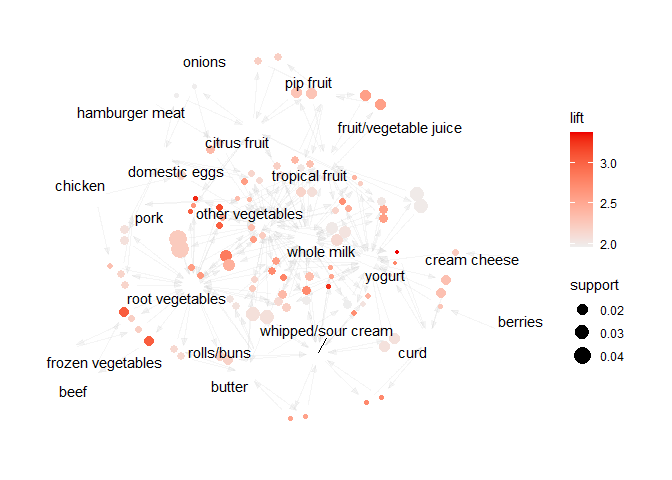

##Clustering and PCA

<table class=" lightable-material-dark" style="font-family: &quot;Source Sans Pro&quot;, helvetica, sans-serif; margin-left: auto; margin-right: auto;">
<thead>
<tr>
<th style="text-align:left;">
</th>
<th style="text-align:right;">
Kmeans
</th>
<th style="text-align:right;">
Kmeans++
</th>
</tr>
</thead>
<tbody>
<tr>
<td style="text-align:left;">
within cluster error for wine
</td>
<td style="text-align:right;">
56135.28
</td>
<td style="text-align:right;">
56135.28
</td>
</tr>
<tr>
<td style="text-align:left;">
between cluster error for wine
</td>
<td style="text-align:right;">
15320.72
</td>
<td style="text-align:right;">
15320.72
</td>
</tr>
<tr>
<td style="text-align:left;">
within cluster error for quality
</td>
<td style="text-align:right;">
30667.58
</td>
<td style="text-align:right;">
30553.13
</td>
</tr>
<tr>
<td style="text-align:left;">
between cluster error for quality
</td>
<td style="text-align:right;">
40788.42
</td>
<td style="text-align:right;">
40902.87
</td>
</tr>
</tbody>
</table>

    ##                            PC1       PC2
    ## fixed.acidity       -0.2387989 0.3363545
    ## volatile.acidity    -0.3807575 0.1175497
    ## citric.acid          0.1523884 0.1832994
    ## residual.sugar       0.3459199 0.3299142
    ## chlorides           -0.2901126 0.3152580
    ## free.sulfur.dioxide  0.4309140 0.0719326

    ## Importance of first k=2 (out of 11) components:
    ##                           PC1    PC2
    ## Standard deviation     1.7407 1.5792
    ## Proportion of Variance 0.2754 0.2267
    ## Cumulative Proportion  0.2754 0.5021

## Association Rules

    ## Apriori
    ## 
    ## Parameter specification:
    ##  confidence minval smax arem  aval originalSupport maxtime support minlen
    ##         0.1    0.1    1 none FALSE            TRUE       5   0.001      2
    ##  maxlen target  ext
    ##       4  rules TRUE
    ## 
    ## Algorithmic control:
    ##  filter tree heap memopt load sort verbose
    ##     0.1 TRUE TRUE  FALSE TRUE    2    TRUE
    ## 
    ## Absolute minimum support count: 9 
    ## 
    ## set item appearances ...[0 item(s)] done [0.00s].
    ## set transactions ...[170 item(s), 9835 transaction(s)] done [0.00s].
    ## sorting and recoding items ... [157 item(s)] done [0.00s].
    ## creating transaction tree ... done [0.01s].
    ## checking subsets of size 1 2 3 4 done [0.01s].
    ## writing ... [30843 rule(s)] done [0.01s].
    ## creating S4 object  ... done [0.03s].

    ##      lhs                    rhs                support     confidence
    ## [1]  {honey}             => {whole milk}       0.001118454 0.7333333 
    ## [2]  {soap}              => {whole milk}       0.001118454 0.4230769 
    ## [3]  {tidbits}           => {soda}             0.001016777 0.4347826 
    ## [4]  {tidbits}           => {rolls/buns}       0.001220132 0.5217391 
    ## [5]  {cocoa drinks}      => {whole milk}       0.001321810 0.5909091 
    ## [6]  {snack products}    => {soda}             0.001118454 0.3666667 
    ## [7]  {snack products}    => {rolls/buns}       0.001118454 0.3666667 
    ## [8]  {pudding powder}    => {whole milk}       0.001321810 0.5652174 
    ## [9]  {cooking chocolate} => {whole milk}       0.001321810 0.5200000 
    ## [10] {bathroom cleaner}  => {soda}             0.001016777 0.3703704 
    ## [11] {bathroom cleaner}  => {other vegetables} 0.001016777 0.3703704 
    ## [12] {nuts/prunes}       => {rolls/buns}       0.001016777 0.3030303 
    ## [13] {nuts/prunes}       => {whole milk}       0.001220132 0.3636364 
    ## [14] {brandy}            => {shopping bags}    0.001321810 0.3170732 
    ## [15] {brandy}            => {rolls/buns}       0.001118454 0.2682927 
    ## [16] {nut snack}         => {soda}             0.001016777 0.3225806 
    ## [17] {potato products}   => {pastry}           0.001016777 0.3571429 
    ## [18] {potato products}   => {whole milk}       0.001220132 0.4285714 
    ## [19] {artif. sweetener}  => {yogurt}           0.001118454 0.3437500 
    ## [20] {artif. sweetener}  => {other vegetables} 0.001016777 0.3125000 
    ## [21] {artif. sweetener}  => {whole milk}       0.001118454 0.3437500 
    ## [22] {male cosmetics}    => {bottled water}    0.001321810 0.2888889 
    ## [23] {male cosmetics}    => {yogurt}           0.001016777 0.2222222 
    ## [24] {light bulbs}       => {yogurt}           0.001220132 0.2926829 
    ## [25] {light bulbs}       => {other vegetables} 0.001321810 0.3170732 
    ## [26] {syrup}             => {other vegetables} 0.001118454 0.3437500 
    ## [27] {canned fruit}      => {citrus fruit}     0.001118454 0.3437500 
    ## [28] {canned fruit}      => {other vegetables} 0.001118454 0.3437500 
    ## [29] {canned fruit}      => {whole milk}       0.001321810 0.4062500 
    ## [30] {rum}               => {other vegetables} 0.001525165 0.3409091 
    ## [31] {rum}               => {whole milk}       0.001728521 0.3863636 
    ## [32] {meat spreads}      => {cream cheese}     0.001118454 0.2619048 
    ## [33] {meat spreads}      => {soda}             0.001423488 0.3333333 
    ## [34] {meat spreads}      => {yogurt}           0.001830198 0.4285714 
    ## [35] {meat spreads}      => {rolls/buns}       0.001321810 0.3095238 
    ## [36] {meat spreads}      => {whole milk}       0.001321810 0.3095238 
    ## [37] {skin care}         => {yogurt}           0.001016777 0.2857143 
    ## [38] {skin care}         => {rolls/buns}       0.001423488 0.4000000 
    ## [39] {skin care}         => {other vegetables} 0.001220132 0.3428571 
    ## [40] {skin care}         => {whole milk}       0.001626843 0.4571429 
    ## [41] {specialty fat}     => {margarine}        0.001220132 0.3333333 
    ## [42] {specialty fat}     => {other vegetables} 0.001118454 0.3055556 
    ## [43] {specialty fat}     => {whole milk}       0.001220132 0.3333333 
    ## [44] {sparkling wine}    => {root vegetables}  0.001016777 0.1818182 
    ## [45] {sparkling wine}    => {other vegetables} 0.001525165 0.2727273 
    ## [46] {sparkling wine}    => {whole milk}       0.001016777 0.1818182 
    ## [47] {tea}               => {bottled beer}     0.001118454 0.2894737 
    ## [48] {tea}               => {tropical fruit}   0.001321810 0.3421053 
    ## [49] {tea}               => {rolls/buns}       0.001118454 0.2894737 
    ## [50] {tea}               => {other vegetables} 0.001525165 0.3947368 
    ##      coverage    lift      count
    ## [1]  0.001525165 2.8700093 11   
    ## [2]  0.002643620 1.6557746 11   
    ## [3]  0.002338587 2.4933452 10   
    ## [4]  0.002338587 2.8365419 12   
    ## [5]  0.002236909 2.3126108 13   
    ## [6]  0.003050330 2.1027211 11   
    ## [7]  0.003050330 1.9934586 11   
    ## [8]  0.002338587 2.2120625 13   
    ## [9]  0.002541942 2.0350975 13   
    ## [10] 0.002745297 2.1239607 10   
    ## [11] 0.002745297 1.9141317 10   
    ## [12] 0.003355363 1.6474865 10   
    ## [13] 0.003355363 1.4231451 12   
    ## [14] 0.004168785 3.2181782 13   
    ## [15] 0.004168785 1.4586283 11   
    ## [16] 0.003152008 1.8499013 10   
    ## [17] 0.002846975 4.0142857 10   
    ## [18] 0.002846975 1.6772782 12   
    ## [19] 0.003253686 2.4641263 11   
    ## [20] 0.003253686 1.6150486 10   
    ## [21] 0.003253686 1.3453169 11   
    ## [22] 0.004575496 2.6138199 13   
    ## [23] 0.004575496 1.5929705 10   
    ## [24] 0.004168785 2.0980587 12   
    ## [25] 0.004168785 1.6386835 13   
    ## [26] 0.003253686 1.7765535 11   
    ## [27] 0.003253686 4.1584025 11   
    ## [28] 0.003253686 1.7765535 11   
    ## [29] 0.003253686 1.5899199 13   
    ## [30] 0.004473818 1.7618712 15   
    ## [31] 0.004473818 1.5120917 17   
    ## [32] 0.004270463 6.6047009 11   
    ## [33] 0.004270463 1.9115646 14   
    ## [34] 0.004270463 3.0721574 18   
    ## [35] 0.004270463 1.6827898 13   
    ## [36] 0.004270463 1.2113676 13   
    ## [37] 0.003558719 2.0481050 10   
    ## [38] 0.003558719 2.1746821 14   
    ## [39] 0.003558719 1.7719390 12   
    ## [40] 0.003558719 1.7890967 16   
    ## [41] 0.003660397 5.7014493 12   
    ## [42] 0.003660397 1.5791586 11   
    ## [43] 0.003660397 1.3045497 12   
    ## [44] 0.005592272 1.6680801 10   
    ## [45] 0.005592272 1.4094970 15   
    ## [46] 0.005592272 0.7115726 10   
    ## [47] 0.003863752 3.5946637 11   
    ## [48] 0.003863752 3.2602764 13   
    ## [49] 0.003863752 1.5737831 11   
    ## [50] 0.003863752 2.0400614 15

